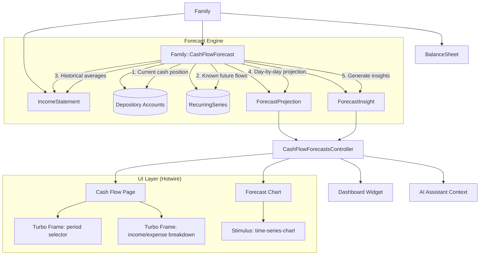
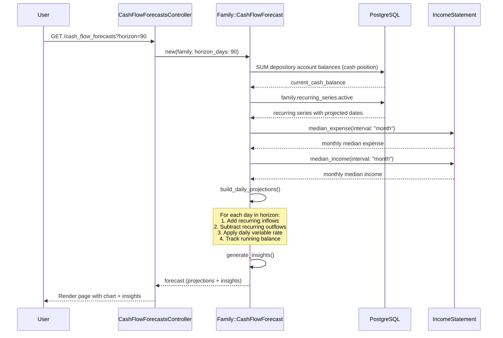
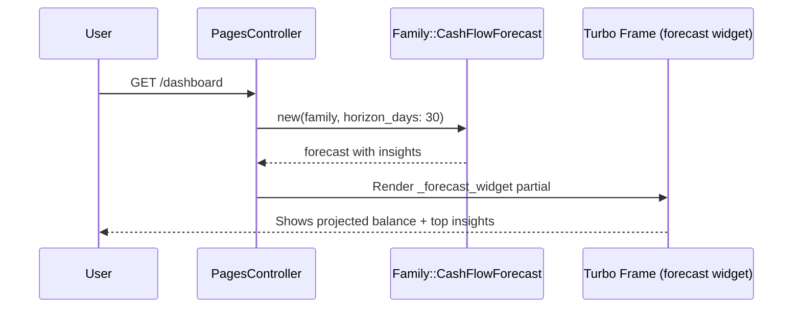

# Design Document: Cash Flow Forecasting and Insights

## Overview

This feature projects future account balances by combining current cash position (sum of depository account balances) with known recurring transactions from `RecurringSeries` and historical spending averages from `IncomeStatement`. The forecast engine is a `Family::CashFlowForecast` PORO that generates a day-by-day projected balance trajectory for 30/60/90 day horizons.

The feature also surfaces actionable cash flow insights (upcoming bills, spending comparisons, surplus/deficit projections) as structured data consumed by a dashboard widget, a dedicated cash flow page with income vs expense breakdowns, and the AI assistant context. A Stimulus-driven D3.js time series chart renders the forecast trajectory, reusing the existing `time-series-chart` controller pattern with an additional dashed-line region for projected values.

## Architecture



## Sequence Diagrams

### Forecast Generation Flow



### Dashboard Widget Flow



## Components and Interfaces

### Component 1: Family::CashFlowForecast (PORO)

**Purpose**: Core forecast engine. Computes day-by-day projected cash balance by layering recurring transactions onto the current cash position, filling gaps with historical spending averages.

```ruby
# app/models/family/cash_flow_forecast.rb
class Family::CashFlowForecast
  HORIZONS = { short: 30, medium: 60, long: 90 }.freeze

  attr_reader :family, :horizon_days, :start_date

  def initialize(family, horizon_days: 30)
    @family = family
    @horizon_days = horizon_days.clamp(1, 365)
    @start_date = Date.current
  end

  # Returns array of DailyProjection structs
  def projections
    @projections ||= build_daily_projections
  end

  # Returns array of ForecastInsight structs
  def insights
    @insights ||= generate_insights
  end

  # Current sum of all depository account balances in family currency
  def current_cash_balance
    @current_cash_balance ||= calculate_current_cash_balance
  end

  # Projected balance at end of horizon
  def projected_end_balance
    projections.last&.balance || current_cash_balance
  end

  # Net change over the forecast period
  def projected_net_change
    projected_end_balance - current_cash_balance
  end

  # Build a Series object compatible with time-series-chart controller
  def to_series
    build_forecast_series
  end
end
```

**Responsibilities**:

- Calculate current cash position from depository accounts
- Collect known future flows from active RecurringSeries
- Derive variable expense/income rates from IncomeStatement historical averages
- Build day-by-day balance projections
- Generate actionable insights from the projection data
- Produce Series-compatible output for the time series chart

### Component 2: CashFlowForecastsController

**Purpose**: Thin controller serving the cash flow forecast page, chart data, and dashboard widget. All queries scoped to `Current.family`.

```ruby
# app/controllers/cash_flow_forecasts_controller.rb
class CashFlowForecastsController < ApplicationController
  include Periodable

  def show
    @horizon = (params[:horizon] || 30).to_i.clamp(30, 90)
    @forecast = Current.family.cash_flow_forecast(horizon_days: @horizon)

    @period = period_from_params || Period.last_30_days
    @income_totals = Current.family.income_statement.income_totals(period: @period)
    @expense_totals = Current.family.income_statement.expense_totals(period: @period)

    @breadcrumbs = [["Home", root_path], ["Cash Flow", nil]]
  end
end
```

**Responsibilities**:

- Serve forecast page with horizon selection (30/60/90 days)
- Provide historical income vs expense breakdown via IncomeStatement
- Delegate all business logic to Family::CashFlowForecast

### Component 3: Family#cash_flow_forecast (Convenience Method)

**Purpose**: Following Convention 2 (models answer questions about themselves), Family exposes a convenience method.

```ruby
# In app/models/family.rb
def cash_flow_forecast(horizon_days: 30)
  Family::CashFlowForecast.new(self, horizon_days: horizon_days)
end
```

## Data Models

### No New Tables Required

This feature is purely computational — it reads from existing models (`Account`, `Entry`, `RecurringSeries`, `IncomeStatement`) and produces in-memory projections. No new database tables or migrations are needed.

### Core Data Structures (In-Memory)

```ruby
# Defined inside Family::CashFlowForecast

DailyProjection = Data.define(
  :date,           # Date
  :balance,        # BigDecimal — projected balance at end of day
  :inflows,        # BigDecimal — total inflows on this day (negative amounts = inflows)
  :outflows,       # BigDecimal — total outflows on this day (positive amounts = outflows)
  :net_flow,       # BigDecimal — inflows - outflows
  :recurring_items # Array<RecurringItem> — which recurring series hit this day
)

RecurringItem = Data.define(
  :recurring_series_id, # UUID
  :title,               # String — series title
  :amount,              # BigDecimal — expected amount
  :series_type          # String — "bill", "subscription", or "income"
)

ForecastInsight = Data.define(
  :kind,       # Symbol — :upcoming_bills, :spending_comparison, :surplus_deficit, :low_balance_warning
  :title,      # String — human-readable title
  :description,# String — human-readable description
  :value,      # Money — associated monetary value
  :metadata    # Hash — additional structured data for rendering
)
```

**Validation Rules**:

- `DailyProjection.date` must be within [start_date, start_date + horizon_days]
- `DailyProjection.balance` is computed, not user-supplied
- `ForecastInsight.kind` must be one of the defined insight types
- `ForecastInsight.value` uses the family's currency

## Algorithmic Pseudocode

### Main Forecast Algorithm

```ruby
# Family::CashFlowForecast#build_daily_projections
def build_daily_projections
  balance = current_cash_balance
  recurring_flows = build_recurring_flow_map
  daily_variable_expense = daily_variable_expense_rate
  daily_variable_income = daily_variable_income_rate

  (0...horizon_days).map do |offset|
    date = start_date + offset.days
    recurring_items = recurring_flows[date] || []

    recurring_inflows = recurring_items
      .select { |item| item.series_type == "income" }
      .sum(&:amount)

    recurring_outflows = recurring_items
      .reject { |item| item.series_type == "income" }
      .sum(&:amount)

    # Variable flows = historical average minus what's already covered by recurring
    variable_outflow = daily_variable_expense
    variable_inflow = daily_variable_income

    total_inflows = recurring_inflows + variable_inflow
    total_outflows = recurring_outflows + variable_outflow
    net_flow = total_inflows - total_outflows

    balance += net_flow

    DailyProjection.new(
      date: date,
      balance: balance,
      inflows: total_inflows,
      outflows: total_outflows,
      net_flow: net_flow,
      recurring_items: recurring_items
    )
  end
end
```

**Preconditions:**

- `current_cash_balance` has been calculated (sum of depository balances)
- `RecurringSeries` records exist for the family (may be empty)
- `IncomeStatement` can provide historical median expense/income

**Postconditions:**

- Returns array of exactly `horizon_days` DailyProjection structs
- Each projection's balance = previous day's balance + net_flow
- First projection's balance = current_cash_balance + day 0 net_flow
- All dates are consecutive from start_date

**Loop Invariants:**

- `balance` always equals `current_cash_balance + sum(net_flow for all previous days)`
- Each DailyProjection.date = start_date + offset

### Cash Position Calculation

```ruby
# Family::CashFlowForecast#calculate_current_cash_balance
def calculate_current_cash_balance
  depository_accounts = family.accounts.visible.where(
    accountable_type: "Depository"
  )

  depository_accounts.sum do |account|
    if account.currency == family.currency
      account.balance
    else
      rate = ExchangeRate.find_rate(
        from: account.currency,
        to: family.currency,
        date: Date.current
      )
      account.balance * (rate || 1)
    end
  end
end
```

**Preconditions:**

- Family has at least one visible depository account (may have zero — returns 0)
- Account balances are current (synced)

**Postconditions:**

- Returns a BigDecimal in the family's base currency
- All depository balances are converted using current exchange rates
- Non-depository accounts (investments, property, etc.) are excluded

### Recurring Flow Map Construction

```ruby
# Family::CashFlowForecast#build_recurring_flow_map
def build_recurring_flow_map
  end_date = start_date + horizon_days.days
  flow_map = Hash.new { |h, k| h[k] = [] }

  family.recurring_series.active.includes(:merchant).find_each do |series|
    projected_dates = series.projected_dates_in_range(start_date, end_date)

    projected_dates.each do |date|
      flow_map[date] << RecurringItem.new(
        recurring_series_id: series.id,
        title: series.title,
        amount: series.average_amount,
        series_type: series.series_type
      )
    end
  end

  flow_map
end
```

**Preconditions:**

- `RecurringSeries` model exists with `projected_dates_in_range` method (Feature #1 dependency)
- Active series have valid `average_amount` and `frequency`

**Postconditions:**

- Returns Hash<Date, Array<RecurringItem>>
- Only dates within [start_date, start_date + horizon_days] are keys
- Each RecurringItem has the series amount in its original currency

### Variable Expense/Income Rate Calculation

```ruby
# Family::CashFlowForecast#daily_variable_expense_rate
def daily_variable_expense_rate
  monthly_median = family.income_statement.median_expense(interval: "month")
  monthly_recurring_expense = family.recurring_series
    .active.bills_and_subscriptions
    .sum(&:monthly_cost)

  # Variable = total historical - known recurring
  monthly_variable = [monthly_median - monthly_recurring_expense, 0].max
  monthly_variable / 30.0
end

# Family::CashFlowForecast#daily_variable_income_rate
def daily_variable_income_rate
  monthly_median = family.income_statement.median_income(interval: "month")
  monthly_recurring_income = family.recurring_series
    .active.incomes
    .sum(&:monthly_cost)

  monthly_variable = [monthly_median - monthly_recurring_income, 0].max
  monthly_variable / 30.0
end
```

**Preconditions:**

- IncomeStatement has sufficient historical data (at least 1 month)
- RecurringSeries monthly_cost is correctly normalized

**Postconditions:**

- Returns a non-negative BigDecimal representing daily variable rate
- Variable rate = (historical median - known recurring) / 30
- If recurring exceeds historical median, variable rate is 0 (no double-counting)

### Insight Generation Algorithm

```ruby
# Family::CashFlowForecast#generate_insights
def generate_insights
  insights = []

  # Insight 1: Upcoming bills in next 7 days
  upcoming_items = projections.first(7).flat_map(&:recurring_items)
    .reject { |item| item.series_type == "income" }
  if upcoming_items.any?
    total = upcoming_items.sum(&:amount)
    insights << ForecastInsight.new(
      kind: :upcoming_bills,
      title: "Upcoming bills",
      description: "#{upcoming_items.size} bills totaling #{format_money(total)} due in the next 7 days",
      value: Money.new(total, family.currency),
      metadata: { count: upcoming_items.size, items: upcoming_items.map(&:title) }
    )
  end

  # Insight 2: Spending comparison vs prior month
  current_month_expense = family.income_statement.expense_totals(period: Period.current_month).total
  prior_month_expense = family.income_statement.expense_totals(period: Period.previous_month).total
  if prior_month_expense.positive?
    pct_change = ((current_month_expense - prior_month_expense).to_f / prior_month_expense * 100).round(1)
    direction = pct_change.positive? ? "more" : "less"
    insights << ForecastInsight.new(
      kind: :spending_comparison,
      title: "Spending trend",
      description: "You're spending #{pct_change.abs}% #{direction} than last month",
      value: Money.new(current_month_expense - prior_month_expense, family.currency),
      metadata: { percent_change: pct_change, current: current_month_expense, prior: prior_month_expense }
    )
  end

  # Insight 3: Surplus or deficit projection
  net = projected_net_change
  if net.negative?
    insights << ForecastInsight.new(
      kind: :surplus_deficit,
      title: "Projected deficit",
      description: "Cash balance projected to decrease by #{format_money(net.abs)} over #{horizon_days} days",
      value: Money.new(net, family.currency),
      metadata: { horizon_days: horizon_days }
    )
  else
    insights << ForecastInsight.new(
      kind: :surplus_deficit,
      title: "Projected surplus",
      description: "Cash balance projected to increase by #{format_money(net)} over #{horizon_days} days",
      value: Money.new(net, family.currency),
      metadata: { horizon_days: horizon_days }
    )
  end

  # Insight 4: Low balance warning
  min_projection = projections.min_by(&:balance)
  if min_projection.balance.negative?
    insights << ForecastInsight.new(
      kind: :low_balance_warning,
      title: "Low balance alert",
      description: "Cash balance projected to go negative on #{min_projection.date.strftime('%b %d')}",
      value: Money.new(min_projection.balance, family.currency),
      metadata: { date: min_projection.date, balance: min_projection.balance }
    )
  end

  insights
end
```

**Preconditions:**

- `projections` has been computed
- IncomeStatement can provide current and prior month totals

**Postconditions:**

- Returns array of 1-4 ForecastInsight structs
- Each insight has a valid kind, title, description, value, and metadata
- Upcoming bills insight only appears if there are bills in the next 7 days
- Low balance warning only appears if projected balance goes negative

## Key Functions with Formal Specifications

### Function: Family::CashFlowForecast#to_series

```ruby
def to_series
  # Build a Series with actual historical data + projected future data
  # The chart uses this to render solid line (historical) + dashed line (projected)
  historical_values = build_historical_balance_values
  projected_values = projections.map do |proj|
    { date: proj.date, value: Money.new(proj.balance, family.currency) }
  end

  all_values = historical_values + projected_values
  Series.from_raw_values(all_values)
end
```

**Preconditions:**

- `projections` has been computed
- Family has at least one depository account with balance history

**Postconditions:**

- Returns a `Series` object compatible with the `time-series-chart` Stimulus controller
- Historical portion uses actual balance data
- Projected portion uses computed DailyProjection balances
- Values are in the family's base currency

### Function: Family::CashFlowForecast#build_historical_balance_values

```ruby
def build_historical_balance_values
  depository_ids = family.accounts.visible
    .where(accountable_type: "Depository").pluck(:id)

  return [] if depository_ids.empty?

  # Use existing Balance::ChartSeriesBuilder pattern for last 30 days
  builder = Balance::ChartSeriesBuilder.new(
    account_ids: depository_ids,
    currency: family.currency,
    period: Period.last_30_days,
    favorable_direction: "up"
  )

  builder.cash_balance_series.values.map do |v|
    { date: v.date, value: v.value }
  end
end
```

**Preconditions:**

- Family has visible depository accounts

**Postconditions:**

- Returns array of `{ date:, value: }` hashes for the last 30 days
- Values are in family currency, converted via exchange rates
- Empty array if no depository accounts exist

### Function: Family::CashFlowForecast#format_money (private helper)

```ruby
def format_money(amount)
  Money.new(amount.abs, family.currency).format
end
```

**Preconditions:**

- `amount` is a numeric value
- `family.currency` is a valid currency code

**Postconditions:**

- Returns formatted string with currency symbol and amount

## Example Usage

```ruby
# Generate a 90-day forecast for the current family
forecast = Current.family.cash_flow_forecast(horizon_days: 90)

# Access current cash position
forecast.current_cash_balance
# => 12450.00

# Get day-by-day projections
forecast.projections.first
# => #<DailyProjection date: 2025-07-15, balance: 12380.50, inflows: 0, outflows: 69.50, ...>

forecast.projections.last
# => #<DailyProjection date: 2025-10-12, balance: 9823.17, ...>

# Projected end balance and net change
forecast.projected_end_balance  # => 9823.17
forecast.projected_net_change   # => -2626.83

# Get actionable insights
forecast.insights
# => [
#   #<ForecastInsight kind: :upcoming_bills, title: "Upcoming bills",
#     description: "3 bills totaling $245.97 due in the next 7 days", ...>,
#   #<ForecastInsight kind: :spending_comparison, title: "Spending trend",
#     description: "You're spending 12.3% more than last month", ...>,
#   #<ForecastInsight kind: :surplus_deficit, title: "Projected deficit",
#     description: "Cash balance projected to decrease by $2,626.83 over 90 days", ...>
# ]

# Build chart series for the time-series-chart Stimulus controller
series = forecast.to_series
series.to_json  # => { start_date: ..., values: [...], ... }

# Use in dashboard widget (short horizon)
widget_forecast = Current.family.cash_flow_forecast(horizon_days: 30)
widget_forecast.insights.select { |i| i.kind == :upcoming_bills }

# Historical income vs expense for the cash flow report page
income = Current.family.income_statement.income_totals(period: Period.last_30_days)
expense = Current.family.income_statement.expense_totals(period: Period.last_30_days)
```

## Correctness Properties

_A property is a characteristic or behavior that should hold true across all valid executions of a system — essentially, a formal statement about what the system should do._

### Property 1: Projection count matches horizon

_For any_ valid horizon_days value H (1 ≤ H ≤ 365), the forecast SHALL produce exactly H DailyProjection structs.

**Validates: Requirements 1.1, 1.2**

### Property 2: Balance continuity

_For any_ forecast, the balance of projection[i] SHALL equal projection[i-1].balance + projection[i].net_flow, and projection[0].balance SHALL equal current_cash_balance + projection[0].net_flow.

**Validates: Requirements 1.3, 2.1**

### Property 3: Net flow consistency

_For any_ DailyProjection, net_flow SHALL equal inflows - outflows.

**Validates: Requirement 2.2**

### Property 4: Date consecutiveness

_For any_ forecast, the dates in projections SHALL be consecutive starting from start_date, with projection[i].date = start_date + i days.

**Validates: Requirement 1.2**

### Property 5: Cash position excludes non-depository accounts

_For any_ family, current_cash_balance SHALL equal the sum of balances from visible Depository accounts only, converted to the family's base currency.

**Validates: Requirement 2.1**

### Property 6: Variable rate non-negativity

_For any_ family, daily_variable_expense_rate and daily_variable_income_rate SHALL be non-negative (≥ 0).

**Validates: Requirement 3.3**

### Property 7: No double-counting of recurring flows

_For any_ family where recurring monthly cost exceeds historical median, the variable rate SHALL be 0, ensuring recurring flows are not counted twice.

**Validates: Requirement 3.2**

### Property 8: Recurring items appear on correct dates

_For any_ active RecurringSeries with projected dates in the forecast horizon, the corresponding RecurringItem SHALL appear in the DailyProjection for that exact date.

**Validates: Requirement 3.1**

### Property 9: Insight generation completeness

_For any_ forecast, the surplus_deficit insight SHALL always be present. The upcoming_bills insight SHALL be present if and only if there are recurring bill/subscription items in the first 7 days. The low_balance_warning SHALL be present if and only if any projected balance is negative.

**Validates: Requirements 4.1, 4.2, 4.3, 4.4**

### Property 10: Series output compatibility

_For any_ forecast, to_series SHALL return a valid Series object where all values have dates and Money values in the family's currency.

**Validates: Requirement 5.1**

### Property 11: Family scoping

_For any_ forecast, all data (accounts, recurring series, income statement) SHALL be scoped to the forecast's family. No cross-family data leakage.

**Validates: Requirement 7.1**

### Property 12: Horizon clamping

_For any_ horizon_days input, the effective horizon SHALL be clamped to [1, 365].

**Validates: Requirement 1.1**

## Error Handling

### Error Scenario 1: No Depository Accounts

**Condition**: Family has no visible depository accounts.
**Response**: `current_cash_balance` returns 0. Forecast proceeds with zero starting balance. Insights still generated from recurring series data.
**Recovery**: Once depository accounts are added and synced, forecast will include their balances.

### Error Scenario 2: No Recurring Series (Feature #1 Not Yet Deployed)

**Condition**: Family has no RecurringSeries records (Feature #1 dependency not yet available).
**Response**: `build_recurring_flow_map` returns empty hash. Forecast uses only historical averages for projections. No upcoming_bills insight generated.
**Recovery**: Graceful degradation — forecast still works with reduced accuracy. Once recurring detection runs, forecast improves.

### Error Scenario 3: Insufficient Historical Data

**Condition**: Family is new with less than 1 month of transaction history.
**Response**: `IncomeStatement.median_expense` and `median_income` return 0. Forecast shows flat projection from current balance plus any recurring flows.
**Recovery**: As transaction history accumulates, forecasts become more accurate.

### Error Scenario 4: Multi-Currency Conversion Failure

**Condition**: Exchange rate not available for a depository account's currency.
**Response**: Falls back to rate of 1.0 (same as existing pattern in `IncomeStatement::Totals`). Balance may be approximate.
**Recovery**: Once exchange rate data is available via provider sync, next forecast will be accurate.

### Error Scenario 5: RecurringSeries#projected_dates_in_range Fails

**Condition**: A RecurringSeries has invalid data (nil last_observed_date on active series).
**Response**: `projected_dates_in_range` returns empty array per its contract. That series is silently excluded from the forecast.
**Recovery**: Next sync will either fix the series data or mark it as paused.

## Testing Strategy

### Unit Testing Approach

- Test `Family::CashFlowForecast` with fixture data:
  - Family with depository accounts and known balances
  - Active RecurringSeries with various frequencies
  - Historical transactions for IncomeStatement medians
- Test `build_daily_projections` verifies projection count, balance continuity, date consecutiveness
- Test `calculate_current_cash_balance` with single/multi-currency depository accounts
- Test `build_recurring_flow_map` with various series frequencies and date ranges
- Test `daily_variable_expense_rate` and `daily_variable_income_rate` including edge case where recurring exceeds historical
- Test `generate_insights` for each insight type and edge cases (no bills, negative balance, etc.)
- Test `to_series` produces valid Series object
- Test edge cases: no accounts, no recurring series, no history
- Use Minitest + fixtures (never RSpec or FactoryBot)

### Property-Based Testing Approach

**Property Test Library**: None required — use Minitest assertions with generated/parameterized data.

Key properties to test:

- For any horizon H, projections.size == H
- For any projection sequence, balance[i] == balance[i-1] + net_flow[i]
- For any projection, net_flow == inflows - outflows
- Variable rates are always non-negative
- Projected dates are consecutive
- Series output has correct date range

### Integration Testing Approach

- Test controller action renders forecast page with chart data
- Test dashboard widget partial renders with forecast insights
- Test Turbo frame horizon switching returns correct forecast
- Test with empty family (no accounts, no series) — graceful empty state
- Test family scoping — ensure no cross-family data access

## Performance Considerations

- Forecast is computed on-demand (not persisted) — keeps it simple and always fresh
- Cash balance query hits only depository accounts (small subset of all accounts)
- RecurringSeries query uses existing `active` scope with index on `(family_id, status)`
- IncomeStatement medians are cached via `Rails.cache.fetch` (existing pattern)
- Day-by-day projection loop is bounded by horizon (max 365 iterations) — negligible
- Historical balance series reuses `Balance::ChartSeriesBuilder` which is already optimized
- Consider caching forecast results with `family.build_cache_key` if dashboard load becomes slow

## Security Considerations

- All queries scoped to `Current.family` — no cross-family data leakage
- Controller uses existing authentication concern
- No external API calls — forecast is purely local computation
- No user-supplied data stored — projections are ephemeral
- Horizon parameter is clamped to prevent abuse (max 365 days)

## Dependencies

- **Feature #1: Recurring Transactions** — `RecurringSeries` model with `projected_dates_in_range`, `monthly_cost`, `active` scope. Feature degrades gracefully if not yet available.
- **Existing Models**: `Family`, `Account`, `Entry`, `Transaction`, `IncomeStatement`, `BalanceSheet`, `Balance::ChartSeriesBuilder`, `Series`, `Money`, `Period`, `ExchangeRate`
- **Existing UI**: `time-series-chart` Stimulus controller, DS components, TailwindCSS design tokens, Turbo frames
- **No new gems required**
