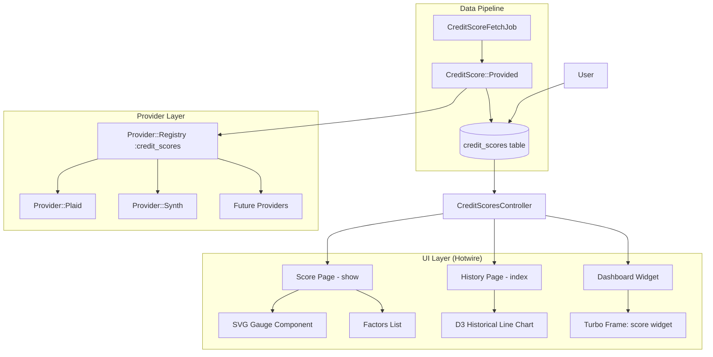
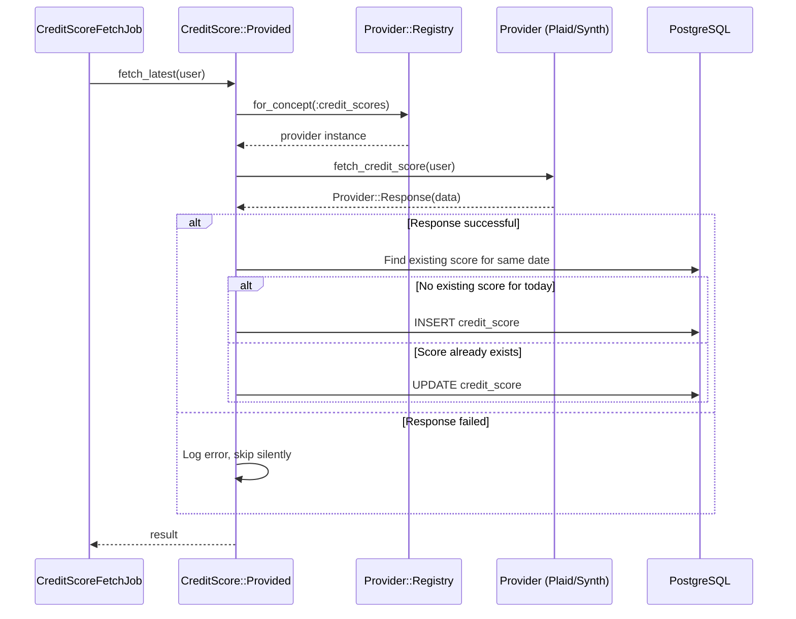
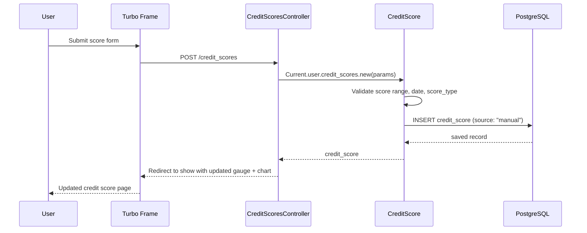

# Design Document: Credit Score Tracking

## Overview

This feature adds credit score tracking to Maybe, allowing users to view and monitor their credit score over time. The system supports both automated fetching via pluggable providers (Plaid, Synth, or future providers) and manual entry. Users see their current score with a gauge visualization, a historical line chart, score factors, and a rating classification (poor through excellent).

A new `CreditScore` model belongs to `User` (not Family, since credit scores are personal). The feature integrates with the existing `Provider::Registry` pattern by adding a `:credit_scores` concept. A `CreditScore::Provided` concern handles provider interactions. The UI uses a dedicated settings/credit-score page, a dashboard widget via Turbo frame, and D3.js/SVG for the gauge and historical chart.

Detection of score changes runs on a configurable schedule via Sidekiq-cron, and users can also trigger a manual refresh. Manual entry is always available regardless of provider configuration.

## Architecture



## Sequence Diagrams

### Automated Credit Score Fetch



### Manual Credit Score Entry



## Components and Interfaces

### Component 1: CreditScore (Model)

**Purpose**: Stores a single credit score observation for a user on a specific date. Belongs to User (credit scores are personal, not family-level).

```ruby
# app/models/credit_score.rb
class CreditScore < ApplicationRecord
  include Provided

  belongs_to :user

  enum :score_type, {
    fico: "fico",
    vantage: "vantage",
    other: "other"
  }

  enum :source, {
    manual: "manual",
    plaid: "plaid",
    synth: "synth"
  }

  SCORE_RANGES = {
    poor:      0..579,
    fair:      580..669,
    good:      670..739,
    very_good: 740..799,
    excellent: 800..850
  }.freeze

  scope :chronological, -> { order(recorded_on: :asc) }
  scope :reverse_chronological, -> { order(recorded_on: :desc) }
  scope :for_period, ->(start_date, end_date) { where(recorded_on: start_date..end_date) }

  validates :score, presence: true,
    numericality: { only_integer: true, greater_than_or_equal_to: 300, less_than_or_equal_to: 850 }
  validates :score_type, presence: true
  validates :source, presence: true
  validates :recorded_on, presence: true
  validates :recorded_on, uniqueness: { scope: [:user_id, :score_type] }

  def rating
    SCORE_RANGES.find { |_rating, range| range.include?(score) }&.first || :poor
  end

  def score_change_since(other_score)
    return nil unless other_score
    score - other_score.score
  end

  def factors_list
    return [] if factors.blank?
    factors
  end
end
```

**Responsibilities**:

- Store score value, type, source, date, and optional factors
- Classify score into rating (poor through excellent)
- Calculate score change between observations
- Scope queries by date range and ordering

### Component 2: CreditScore::Provided (Concern)

**Purpose**: Handles provider interactions for fetching credit scores. Follows the same pattern as `ExchangeRate::Provided`.

```ruby
# app/models/credit_score/provided.rb
module CreditScore::Provided
  extend ActiveSupport::Concern

  class_methods do
    def provider
      registry = Provider::Registry.for_concept(:credit_scores)
      registry.providers.first
    end

    def fetch_for_user(user)
      return nil unless provider.present?

      response = provider.fetch_credit_score(user: user)
      return nil unless response.success?

      data = response.data
      user.credit_scores.find_or_initialize_by(
        recorded_on: data[:recorded_on] || Date.current,
        score_type: data[:score_type] || "fico"
      ).tap do |cs|
        cs.assign_attributes(
          score: data[:score],
          source: data[:source],
          factors: data[:factors] || []
        )
        cs.save!
      end
    end
  end
end
```

**Responsibilities**:

- Look up the configured credit score provider from the registry
- Fetch score data from the provider
- Upsert the score record (one per user + date + score_type)

### Component 3: CreditScoresController

**Purpose**: Thin controller for the credit score page, history, manual entry, and dashboard widget.

```ruby
# app/controllers/credit_scores_controller.rb
class CreditScoresController < ApplicationController
  def show
    @latest_score = Current.user.credit_scores.reverse_chronological.first
    @previous_score = Current.user.credit_scores.reverse_chronological.second
    @scores = Current.user.credit_scores.chronological
  end

  def index
    @period = params[:period] || "1y"
    start_date = period_start_date(@period)
    @scores = Current.user.credit_scores
      .for_period(start_date, Date.current)
      .chronological
  end

  def new
    @credit_score = Current.user.credit_scores.new(
      recorded_on: Date.current,
      score_type: "fico",
      source: "manual"
    )
  end

  def create
    @credit_score = Current.user.credit_scores.new(credit_score_params)
    @credit_score.source = "manual"

    if @credit_score.save
      redirect_to credit_score_path, notice: "Credit score saved."
    else
      render :new, status: :unprocessable_entity
    end
  end

  def destroy
    @credit_score = Current.user.credit_scores.find(params[:id])
    @credit_score.destroy
    redirect_to credit_score_path, notice: "Credit score removed."
  end

  private

  def credit_score_params
    params.require(:credit_score).permit(:score, :score_type, :recorded_on)
  end

  def period_start_date(period)
    case period
    when "3m" then 3.months.ago.to_date
    when "6m" then 6.months.ago.to_date
    when "1y" then 1.year.ago.to_date
    when "2y" then 2.years.ago.to_date
    when "all" then 10.years.ago.to_date
    else 1.year.ago.to_date
    end
  end
end
```

**Responsibilities**:

- Serve the credit score overview page (gauge, factors, change)
- Serve historical chart data filtered by period
- Handle manual score entry and deletion
- All queries scoped to `Current.user`

### Component 4: CreditScoreFetchJob

**Purpose**: Background job to fetch credit scores from configured providers. Runs on schedule via sidekiq-cron and on-demand.

```ruby
# app/jobs/credit_score_fetch_job.rb
class CreditScoreFetchJob < ApplicationJob
  queue_as :default

  def perform(user)
    CreditScore.fetch_for_user(user)
  rescue => e
    Rails.logger.error("CreditScoreFetchJob failed for user #{user.id}: #{e.message}")
    Sentry.capture_exception(e) if defined?(Sentry)
  end
end
```

## Data Models

### CreditScore

```ruby
# db/migrate/XXXXXX_create_credit_scores.rb
create_table :credit_scores, id: :uuid, default: -> { "gen_random_uuid()" } do |t|
  t.references :user, null: false, foreign_key: true, type: :uuid

  t.integer :score, null: false
  t.string :score_type, null: false, default: "fico"  # fico, vantage, other
  t.string :source, null: false, default: "manual"     # manual, plaid, synth
  t.date :recorded_on, null: false

  t.jsonb :factors, default: []  # Array of factor strings/objects

  t.timestamps

  t.index [:user_id, :recorded_on, :score_type], unique: true, name: "idx_credit_scores_user_date_type"
  t.index [:user_id, :recorded_on], name: "idx_credit_scores_user_date"
end
```

**Validation Rules**:

- `score` is required, integer, between 300 and 850
- `score_type` is required, one of: fico, vantage, other
- `source` is required, one of: manual, plaid, synth
- `recorded_on` is required
- Unique constraint: one score per user + date + score_type

### User Extension

```ruby
# Add to User model
has_many :credit_scores, dependent: :destroy
```

## Algorithmic Pseudocode

### Rating Classification Algorithm

```ruby
# CreditScore#rating
def rating
  case score
  when 300..579  then :poor
  when 580..669  then :fair
  when 670..739  then :good
  when 740..799  then :very_good
  when 800..850  then :excellent
  end
end
```

**Preconditions:**

- `score` is an integer between 300 and 850

**Postconditions:**

- Returns exactly one of: :poor, :fair, :good, :very_good, :excellent
- Ranges are contiguous and cover the full 300–850 spectrum with no gaps or overlaps

### Provider Fetch Algorithm

```ruby
# CreditScore::Provided.fetch_for_user
def self.fetch_for_user(user)
  provider = Provider::Registry.for_concept(:credit_scores).providers.first
  return nil unless provider.present?

  response = provider.fetch_credit_score(user: user)
  return nil unless response.success?

  data = response.data
  score = user.credit_scores.find_or_initialize_by(
    recorded_on: data[:recorded_on] || Date.current,
    score_type: data[:score_type] || "fico"
  )

  score.assign_attributes(
    score: data[:score],
    source: data[:source],
    factors: data[:factors] || []
  )

  score.save!
  score
end
```

**Preconditions:**

- `user` is a valid, persisted User record
- Provider::Registry has been configured (may return nil if no provider)

**Postconditions:**

- If no provider configured: returns nil, no side effects
- If provider returns error: returns nil, no side effects
- If provider returns data: upserts a CreditScore record (one per user + date + score_type)
- Existing score for same date + type is updated, not duplicated

### Score History Series Algorithm

```ruby
# Used by the historical chart — returns data points for D3
def self.history_series(user, start_date:, end_date:)
  user.credit_scores
    .for_period(start_date, end_date)
    .chronological
    .pluck(:recorded_on, :score)
    .map { |date, score| { date: date, score: score } }
end
```

**Preconditions:**

- `start_date` ≤ `end_date`
- `user` is a valid User record

**Postconditions:**

- Returns array of `{ date:, score: }` hashes sorted chronologically
- All dates fall within [start_date, end_date]
- Empty array if no scores exist in range

## Key Functions with Formal Specifications

### Function: CreditScore#rating

```ruby
def rating
  SCORE_RANGES.find { |_rating, range| range.include?(score) }&.first || :poor
end
```

**Preconditions:**

- `score` is present and is an integer between 300 and 850

**Postconditions:**

- Returns a symbol: :poor, :fair, :good, :very_good, or :excellent
- The returned rating corresponds to the correct SCORE_RANGES bucket
- Deterministic: same score always returns same rating

### Function: CreditScore#score_change_since

```ruby
def score_change_since(other_score)
  return nil unless other_score
  score - other_score.score
end
```

**Preconditions:**

- `other_score` is nil or a CreditScore instance with a valid `score`

**Postconditions:**

- Returns nil if `other_score` is nil
- Returns an integer (positive = improvement, negative = decline, zero = no change)
- Does not modify either record

### Function: CreditScoresController#period_start_date

```ruby
def period_start_date(period)
  case period
  when "3m" then 3.months.ago.to_date
  when "6m" then 6.months.ago.to_date
  when "1y" then 1.year.ago.to_date
  when "2y" then 2.years.ago.to_date
  when "all" then 10.years.ago.to_date
  else 1.year.ago.to_date
  end
end
```

**Preconditions:**

- `period` is a string (may be any value)

**Postconditions:**

- Returns a Date that is before or equal to Date.current
- Unknown period values default to 1 year ago
- Returned date is always a valid Date object

## Example Usage

```ruby
# Manual entry
score = Current.user.credit_scores.create!(
  score: 742,
  score_type: "fico",
  source: "manual",
  recorded_on: Date.current,
  factors: ["Low credit utilization", "Long credit history"]
)

score.rating        # => :very_good
score.factors_list  # => ["Low credit utilization", "Long credit history"]

# Get latest score and change
latest = Current.user.credit_scores.reverse_chronological.first
previous = Current.user.credit_scores.reverse_chronological.second
latest.score_change_since(previous)  # => 15 (improved by 15 points)

# Historical data for chart
scores = Current.user.credit_scores
  .for_period(1.year.ago.to_date, Date.current)
  .chronological

# Provider fetch (background job)
CreditScoreFetchJob.perform_later(Current.user)

# Dashboard widget query
latest_score = Current.user.credit_scores.reverse_chronological.first
if latest_score
  "#{latest_score.score} - #{latest_score.rating.to_s.titleize}"
end
```

## Correctness Properties

### Property 1: Score range validation

_For any_ CreditScore, the score SHALL be an integer between 300 and 850 inclusive. Creating a record with a score outside this range SHALL be rejected by validation.

**Validates: Requirements 1.1, 1.5**

### Property 2: Rating classification completeness

_For any_ valid CreditScore with a score between 300 and 850, the rating method SHALL return exactly one of :poor, :fair, :good, :very_good, or :excellent. The SCORE_RANGES SHALL cover the entire 300–850 range with no gaps or overlaps.

**Validates: Requirements 2.1, 2.2, 2.3**

### Property 3: Rating classification correctness

_For any_ CreditScore, rating SHALL return :poor for scores 300–579, :fair for 580–669, :good for 670–739, :very_good for 740–799, and :excellent for 800–850.

**Validates: Requirements 2.1, 2.2**

### Property 4: Score uniqueness per user per date per type

_For any_ User, there SHALL be at most one CreditScore per combination of (user_id, recorded_on, score_type). Attempting to create a duplicate SHALL be rejected.

**Validates: Requirement 1.6**

### Property 5: Score change calculation correctness

_For any_ two CreditScores A and B, A.score_change_since(B) SHALL equal A.score - B.score. If B is nil, the result SHALL be nil.

**Validates: Requirement 3.1**

### Property 6: Chronological ordering

_For any_ set of CreditScores returned by the chronological scope, the recorded_on dates SHALL be in non-decreasing order.

**Validates: Requirement 4.1**

### Property 7: Period filtering correctness

_For any_ date range [start_date, end_date], the for_period scope SHALL return only CreditScores with recorded_on within that range inclusive.

**Validates: Requirement 4.2**

### Property 8: User scoping security

_For any_ controller action, CreditScores SHALL be scoped to Current.user. A user SHALL not be able to access, modify, or delete CreditScores belonging to another user.

**Validates: Requirement 7.1**

### Property 9: Manual entry source

_For any_ CreditScore created via the controller create action, the source SHALL be set to "manual" regardless of any user-submitted source parameter.

**Validates: Requirement 5.2**

### Property 10: Provider fetch idempotency

_For any_ provider fetch for the same user, date, and score_type, the operation SHALL upsert (update existing or create new) rather than create duplicates.

**Validates: Requirement 6.3**

### Property 11: Factors storage integrity

_For any_ CreditScore with factors, factors_list SHALL return the stored array. For a CreditScore with nil or empty factors, factors_list SHALL return an empty array.

**Validates: Requirement 1.7**

## Error Handling

### Error Scenario 1: No Provider Configured

**Condition**: No credit score provider is configured in Provider::Registry (common for self-hosted).
**Response**: `CreditScore.fetch_for_user` returns nil. No error raised. Manual entry remains available.
**Recovery**: User configures a provider or continues with manual entry.

### Error Scenario 2: Provider API Failure

**Condition**: Provider returns an error response (network failure, API error, rate limit).
**Response**: `CreditScoreFetchJob` logs the error and reports to Sentry. No score is created or modified.
**Recovery**: Next scheduled fetch will retry. User can also manually enter their score.

### Error Scenario 3: Duplicate Score Entry

**Condition**: User or provider attempts to create a score for a date + type that already exists.
**Response**: Database unique constraint prevents duplicate. `find_or_initialize_by` in provider path handles this via upsert. Manual entry form shows validation error.
**Recovery**: User can edit the existing score or choose a different date.

### Error Scenario 4: Invalid Score Value

**Condition**: User enters a score outside the 300–850 range.
**Response**: ActiveRecord validation rejects the record. Form re-renders with error message.
**Recovery**: User corrects the score value and resubmits.

## Testing Strategy

### Unit Testing Approach

- Test `CreditScore` validations: score range (300–850), required fields, uniqueness constraint
- Test `CreditScore#rating` for each score range boundary (579/580, 669/670, 739/740, 799/800)
- Test `CreditScore#score_change_since` with positive, negative, zero changes, and nil
- Test `CreditScore#factors_list` with present, empty, and nil factors
- Test scopes: `chronological`, `reverse_chronological`, `for_period`
- Test `CreditScore::Provided.fetch_for_user` with mock provider responses (success, failure, nil provider)
- Use Minitest + fixtures (never RSpec or FactoryBot)

### Property-Based Testing Approach

**Property Test Library**: Minitest assertions with generated data.

Key properties to test:

- For any integer score 300–850, `rating` returns a valid rating symbol
- For any two scores, `score_change_since` equals the arithmetic difference
- Rating ranges are contiguous: no score maps to zero or multiple ratings
- `for_period` scope returns only scores within the requested date range
- Provider fetch is idempotent: fetching twice for same date yields one record

### Integration Testing Approach

- Test controller actions: show, index, new, create, destroy with fixture data
- Test user scoping: verify user A cannot access user B's scores
- Test dashboard widget rendering with and without scores
- Test CreditScoreFetchJob with mocked provider

## Performance Considerations

- Credit scores are low-volume data (at most one per day per user per type) — no performance concerns for queries
- Historical chart query uses indexed `(user_id, recorded_on)` — efficient for any date range
- Dashboard widget queries only the latest score — single indexed lookup
- Provider fetch runs in background job — no UI blocking
- No N+1 concerns since CreditScore has no nested associations to eager-load

## Security Considerations

- All queries scoped to `Current.user` — no cross-user data leakage
- Credit scores are personal data — belongs_to :user, not :family
- Controller uses existing authentication concern
- Manual entry forces `source: "manual"` server-side — cannot be spoofed via params
- Provider API keys stored in environment variables / Settings, never in database records
- Factors stored as JSONB — sanitize display output in views to prevent XSS

## Dependencies

- No new gems required
- Relies on existing models: `User`, `Family`
- Relies on existing provider infrastructure: `Provider`, `Provider::Registry`
- Relies on existing UI infrastructure: Turbo frames, D3.js (already in project), TailwindCSS design tokens
- Relies on existing job infrastructure: Sidekiq, sidekiq-cron
