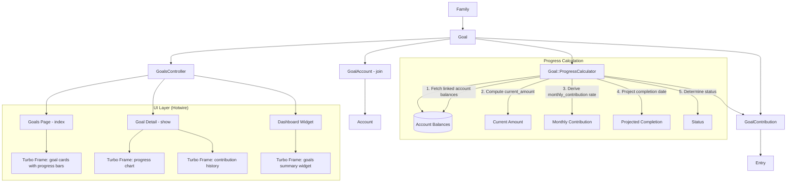
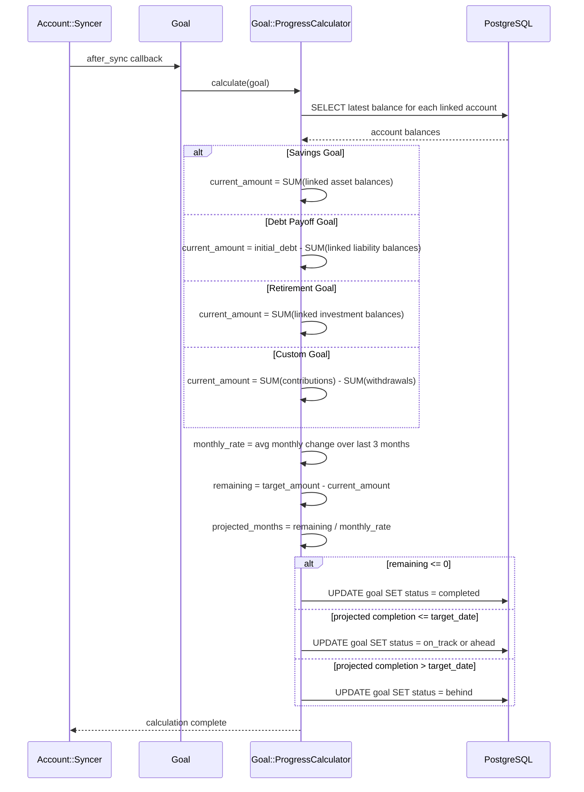
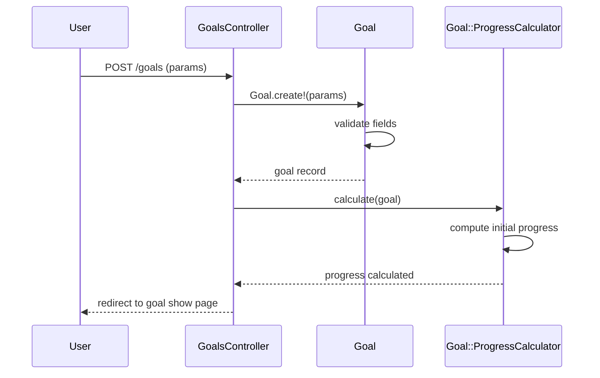

# Design Document: Enhanced Goal Planning

## Overview

This feature introduces a goal planning system that lets users create and track financial goals — savings goals, debt payoff goals, retirement goals, and custom goals. Each goal is owned by a Family, optionally linked to one or more Accounts, and tracks progress toward a target amount by a target date.

The system introduces a `Goal` model with progress calculation derived from linked account balances (savings), balance reduction (debt payoff), or aggregated investment balances (retirement). A `GoalContribution` join model links goals to entries, tracking explicit contributions and withdrawals. A `Goal::ProgressCalculator` PORO computes current progress, projected completion dates, and status (on_track, behind, ahead, completed, paused). The UI includes a goals index page with progress bars, a goal detail page with a historical progress chart (D3.js), and a dashboard widget showing active goal summaries.

## Architecture



## Sequence Diagrams

### Goal Progress Calculation (during Account Sync)



### Goal Creation Flow



## Components and Interfaces

### Component 1: Goal (Model)

**Purpose**: Represents a financial goal belonging to a Family. Tracks target amount, target date, current progress, and status.

```ruby
# app/models/goal.rb
class Goal < ApplicationRecord
  include Monetizable

  belongs_to :family

  has_many :goal_accounts, dependent: :destroy
  has_many :accounts, through: :goal_accounts
  has_many :goal_contributions, dependent: :destroy

  monetize :target_amount, :current_amount

  enum :goal_type, {
    savings: "savings",
    debt_payoff: "debt_payoff",
    retirement: "retirement",
    custom: "custom"
  }

  enum :status, {
    on_track: "on_track",
    behind: "behind",
    ahead: "ahead",
    completed: "completed",
    paused: "paused"
  }

  enum :priority, {
    high: "high",
    medium: "medium",
    low: "low"
  }

  validates :name, :goal_type, :target_amount, :currency, presence: true
  validates :target_amount, numericality: { greater_than: 0 }

  scope :active, -> { where.not(status: %w[completed paused]) }
  scope :completed, -> { where(status: "completed") }
  scope :by_priority, -> { order(Arel.sql("CASE priority WHEN 'high' THEN 0 WHEN 'medium' THEN 1 WHEN 'low' THEN 2 ELSE 3 END")) }

  def progress_percent
    return 0 if target_amount.zero?
    [(current_amount / target_amount.to_f * 100).round(1), 100.0].min
  end

  def remaining_amount
    [target_amount - current_amount, 0].max
  end

  def projected_completion_date
    return nil if monthly_contribution.nil? || monthly_contribution <= 0
    return Date.current if remaining_amount <= 0

    months_remaining = (remaining_amount / monthly_contribution).ceil
    Date.current + months_remaining.months
  end

  def on_track?
    return true if completed?
    return false if target_date.nil? || projected_completion_date.nil?

    projected_completion_date <= target_date
  end

  def days_remaining
    return nil if target_date.nil?
    return 0 if target_date <= Date.current

    (target_date - Date.current).to_i
  end
end
```

**Responsibilities**:

- Store goal metadata (name, type, target, dates, status)
- Calculate progress percentage and remaining amount
- Project completion date from monthly contribution rate
- Determine on-track status relative to target date

### Component 2: GoalAccount (Join Model)

**Purpose**: Links a Goal to one or more Accounts for balance-based progress tracking.

```ruby
# app/models/goal_account.rb
class GoalAccount < ApplicationRecord
  belongs_to :goal
  belongs_to :account

  validates :account_id, uniqueness: { scope: :goal_id }
end
```

### Component 3: GoalContribution (Model)

**Purpose**: Records explicit contributions to or withdrawals from a goal, optionally linked to an Entry.

```ruby
# app/models/goal_contribution.rb
class GoalContribution < ApplicationRecord
  include Monetizable

  belongs_to :goal
  belongs_to :entry, optional: true

  monetize :amount

  validates :amount, :currency, presence: true
  validates :amount, numericality: { other_than: 0 }

  scope :contributions, -> { where("amount > 0") }
  scope :withdrawals, -> { where("amount < 0") }
  scope :chronological, -> { order(:date) }
end
```

### Component 4: Goal::ProgressCalculator (PORO)

**Purpose**: Computes current progress for a goal based on its type and linked accounts. Runs after account sync and on-demand.

```ruby
# app/models/goal/progress_calculator.rb
class Goal::ProgressCalculator
  LOOKBACK_MONTHS = 3

  def initialize(goal)
    @goal = goal
  end

  def calculate
    current = compute_current_amount
    rate = compute_monthly_contribution_rate(current)
    status = determine_status(current, rate)

    goal.update!(
      current_amount: current,
      monthly_contribution: rate,
      status: status
    )
  end

  private

  attr_reader :goal

  def compute_current_amount
    case goal.goal_type
    when "savings"
      goal.accounts.assets.sum(:balance)
    when "debt_payoff"
      initial = goal.target_amount
      current_debt = goal.accounts.liabilities.sum(:balance).abs
      initial - current_debt
    when "retirement"
      goal.accounts.where(accountable_type: "Investment").sum(:balance)
    when "custom"
      goal.goal_contributions.sum(:amount)
    end
  end

  def compute_monthly_contribution_rate(current_amount)
    # Average monthly change over last LOOKBACK_MONTHS months
    balances = recent_monthly_balances
    return 0 if balances.size < 2

    changes = balances.each_cons(2).map { |prev, curr| curr - prev }
    changes.sum / changes.size.to_f
  end

  def recent_monthly_balances
    # Get end-of-month balances for linked accounts over lookback period
    start_date = LOOKBACK_MONTHS.months.ago.beginning_of_month
    goal.accounts.flat_map do |account|
      account.balances
        .where(date: start_date..Date.current)
        .where("date = (SELECT MAX(date) FROM balances b2 WHERE b2.account_id = balances.account_id AND date_trunc('month', b2.date) = date_trunc('month', balances.date))")
        .order(:date)
        .pluck(:balance)
    end
  end

  def determine_status(current_amount, monthly_rate)
    return "completed" if current_amount >= goal.target_amount
    return goal.status if goal.paused?

    projected = projected_completion(current_amount, monthly_rate)

    if goal.target_date.nil? || projected.nil?
      "on_track"
    elsif projected <= goal.target_date
      margin = (goal.target_date - projected).to_i
      margin > 30 ? "ahead" : "on_track"
    else
      "behind"
    end
  end

  def projected_completion(current_amount, monthly_rate)
    return nil if monthly_rate <= 0

    remaining = goal.target_amount - current_amount
    return Date.current if remaining <= 0

    months = (remaining / monthly_rate).ceil
    Date.current + months.months
  end
end
```

**Responsibilities**:

- Compute current amount based on goal type (account balances or contributions)
- Calculate average monthly contribution rate from historical balances
- Determine goal status (on_track, behind, ahead, completed)
- Update goal record with computed values

### Component 5: GoalsController

**Purpose**: Thin controller for goals CRUD, detail view, and dashboard widget.

```ruby
# app/controllers/goals_controller.rb
class GoalsController < ApplicationController
  def index
    @goals = Current.family.goals
      .includes(:accounts, :goal_accounts)
      .active
      .by_priority
  end

  def show
    @goal = Current.family.goals.find(params[:id])
    @contributions = @goal.goal_contributions.chronological
    @progress_series = build_progress_series(@goal)
  end

  def new
    @goal = Current.family.goals.new
  end

  def create
    @goal = Current.family.goals.new(goal_params)
    @goal.currency = Current.family.currency

    if @goal.save
      link_accounts(@goal)
      Goal::ProgressCalculator.new(@goal).calculate
      redirect_to @goal
    else
      render :new, status: :unprocessable_entity
    end
  end

  def edit
    @goal = Current.family.goals.find(params[:id])
  end

  def update
    @goal = Current.family.goals.find(params[:id])

    if @goal.update(goal_params)
      link_accounts(@goal)
      Goal::ProgressCalculator.new(@goal).calculate
      redirect_to @goal
    else
      render :edit, status: :unprocessable_entity
    end
  end

  def destroy
    @goal = Current.family.goals.find(params[:id])
    @goal.destroy!
    redirect_to goals_path
  end

  private

  def goal_params
    params.require(:goal).permit(:name, :goal_type, :target_amount, :target_date,
                                  :icon, :color, :priority, :status)
  end

  def link_accounts(goal)
    account_ids = params.dig(:goal, :account_ids) || []
    goal.goal_accounts.where.not(account_id: account_ids).destroy_all
    account_ids.each do |aid|
      goal.goal_accounts.find_or_create_by!(account_id: aid)
    end
  end

  def build_progress_series(goal)
    # Build Series from goal contributions and balance snapshots for D3 chart
  end
end
```

## Data Models

### Goal

```ruby
# db/migrate/XXXXXX_create_goals.rb
create_table :goals, id: :uuid, default: -> { "gen_random_uuid()" } do |t|
  t.references :family, null: false, foreign_key: true, type: :uuid

  t.string :name, null: false
  t.string :goal_type, null: false          # savings, debt_payoff, retirement, custom
  t.string :status, default: "on_track", null: false  # on_track, behind, ahead, completed, paused
  t.string :priority, default: "medium"     # high, medium, low
  t.string :icon                            # Lucide icon name
  t.string :color                           # Hex color for UI

  t.decimal :target_amount, precision: 19, scale: 4, null: false
  t.decimal :current_amount, precision: 19, scale: 4, default: 0
  t.decimal :monthly_contribution, precision: 19, scale: 4, default: 0
  t.string :currency, null: false

  t.date :target_date                       # Optional deadline
  t.date :started_on                        # When user started tracking

  t.timestamps

  t.index [:family_id, :status], name: "idx_goals_family_status"
  t.index [:family_id, :goal_type], name: "idx_goals_family_type"
end
```

**Validation Rules**:

- `name`, `goal_type`, `target_amount`, `currency` are required (DB NOT NULL)
- `target_amount` must be greater than 0
- `goal_type` must be one of: savings, debt_payoff, retirement, custom
- `status` must be one of: on_track, behind, ahead, completed, paused
- `priority` must be one of: high, medium, low (or nil)

### GoalAccount

```ruby
# db/migrate/XXXXXX_create_goal_accounts.rb
create_table :goal_accounts, id: :uuid, default: -> { "gen_random_uuid()" } do |t|
  t.references :goal, null: false, foreign_key: true, type: :uuid
  t.references :account, null: false, foreign_key: true, type: :uuid

  t.timestamps

  t.index [:goal_id, :account_id], unique: true, name: "idx_goal_accounts_unique"
end
```

### GoalContribution

```ruby
# db/migrate/XXXXXX_create_goal_contributions.rb
create_table :goal_contributions, id: :uuid, default: -> { "gen_random_uuid()" } do |t|
  t.references :goal, null: false, foreign_key: true, type: :uuid
  t.references :entry, foreign_key: true, type: :uuid

  t.decimal :amount, precision: 19, scale: 4, null: false
  t.string :currency, null: false
  t.date :date, null: false
  t.string :description

  t.timestamps

  t.index [:goal_id, :date], name: "idx_goal_contributions_goal_date"
end
```

**Validation Rules**:

- `amount`, `currency`, `date` are required
- `amount` must not be zero (positive = contribution, negative = withdrawal)

## Algorithmic Pseudocode

### Progress Calculation Algorithm

```ruby
# Goal::ProgressCalculator#calculate
def calculate
  # Step 1: Compute current amount based on goal type
  current = case goal.goal_type
  when "savings"
    # Sum of linked asset account balances
    goal.accounts.assets.sum(:balance)
  when "debt_payoff"
    # How much debt has been paid off: target - remaining debt
    goal.target_amount - goal.accounts.liabilities.sum(:balance).abs
  when "retirement"
    # Sum of linked investment account balances
    goal.accounts.where(accountable_type: "Investment").sum(:balance)
  when "custom"
    # Sum of manual contributions minus withdrawals
    goal.goal_contributions.sum(:amount)
  end

  # Step 2: Compute monthly contribution rate from historical data
  monthly_balances = get_end_of_month_balances(lookback: 3.months)
  rate = if monthly_balances.size >= 2
    changes = monthly_balances.each_cons(2).map { |prev, curr| curr - prev }
    changes.sum / changes.size.to_f
  else
    0
  end

  # Step 3: Determine status
  status = if current >= goal.target_amount
    "completed"
  elsif goal.paused?
    goal.status # preserve paused
  elsif rate <= 0 || goal.target_date.nil?
    "on_track" # no projection possible, default optimistic
  else
    remaining = goal.target_amount - current
    months_to_complete = (remaining / rate).ceil
    projected = Date.current + months_to_complete.months

    if projected <= goal.target_date
      margin = (goal.target_date - projected).to_i
      margin > 30 ? "ahead" : "on_track"
    else
      "behind"
    end
  end

  # Step 4: Persist
  goal.update!(current_amount: current, monthly_contribution: rate, status: status)
end
```

**Preconditions:**

- `goal` is a persisted Goal record with valid `goal_type` and `target_amount`
- Linked accounts (if any) have synced balances

**Postconditions:**

- `goal.current_amount` reflects the latest computed value
- `goal.monthly_contribution` reflects the average monthly change
- `goal.status` is one of: completed, on_track, ahead, behind, or paused
- If `current_amount >= target_amount`, status is always "completed"

**Loop Invariants:**

- Monthly balance changes array has `n-1` elements for `n` monthly balances
- All balance values are in the goal's currency

### Status Determination Algorithm

```ruby
# Goal::ProgressCalculator#determine_status
def determine_status(current_amount, monthly_rate)
  # Completed: current meets or exceeds target
  return "completed" if current_amount >= goal.target_amount

  # Paused: preserve user-set pause
  return goal.status if goal.paused?

  # No projection possible
  return "on_track" if monthly_rate <= 0 || goal.target_date.nil?

  # Project completion
  remaining = goal.target_amount - current_amount
  months = (remaining / monthly_rate).ceil
  projected = Date.current + months.months

  if projected <= goal.target_date
    margin_days = (goal.target_date - projected).to_i
    margin_days > 30 ? "ahead" : "on_track"
  else
    "behind"
  end
end
```

**Preconditions:**

- `current_amount` is a non-negative decimal
- `monthly_rate` is a decimal (may be zero or negative)
- `goal.target_amount` is positive

**Postconditions:**

- Returns exactly one of: "completed", "on_track", "ahead", "behind", or the current paused status
- "ahead" only when projected completion is > 30 days before target_date
- "behind" only when projected completion is after target_date

## Key Functions with Formal Specifications

### Function: Goal#progress_percent

```ruby
def progress_percent
  return 0 if target_amount.zero?
  [(current_amount / target_amount.to_f * 100).round(1), 100.0].min
end
```

**Preconditions:**

- `target_amount` and `current_amount` are present decimals

**Postconditions:**

- Returns a float between 0.0 and 100.0
- Returns 0 when target_amount is zero
- Capped at 100.0 even if current_amount exceeds target_amount

### Function: Goal#remaining_amount

```ruby
def remaining_amount
  [target_amount - current_amount, 0].max
end
```

**Preconditions:**

- `target_amount` and `current_amount` are present decimals

**Postconditions:**

- Returns a non-negative decimal
- Returns 0 when current_amount >= target_amount

### Function: Goal#projected_completion_date

```ruby
def projected_completion_date
  return nil if monthly_contribution.nil? || monthly_contribution <= 0
  return Date.current if remaining_amount <= 0

  months_remaining = (remaining_amount / monthly_contribution).ceil
  Date.current + months_remaining.months
end
```

**Preconditions:**

- `monthly_contribution` may be nil, zero, or positive
- `remaining_amount` is non-negative

**Postconditions:**

- Returns nil when monthly_contribution is nil or <= 0
- Returns Date.current when goal is already met
- Returns a future Date when progress is ongoing

### Function: Goal#days_remaining

```ruby
def days_remaining
  return nil if target_date.nil?
  return 0 if target_date <= Date.current

  (target_date - Date.current).to_i
end
```

**Preconditions:**

- `target_date` may be nil

**Postconditions:**

- Returns nil when target_date is nil
- Returns 0 when target_date is today or in the past
- Returns a positive integer for future target dates

## Example Usage

```ruby
# Create a savings goal linked to a checking account
goal = Current.family.goals.create!(
  name: "Emergency Fund",
  goal_type: :savings,
  target_amount: 10_000,
  currency: "USD",
  target_date: Date.new(2026, 1, 1),
  priority: :high,
  icon: "piggy-bank",
  color: "#22c55e"
)
goal.goal_accounts.create!(account: checking_account)
Goal::ProgressCalculator.new(goal).calculate

# Create a debt payoff goal
debt_goal = Current.family.goals.create!(
  name: "Pay Off Credit Card",
  goal_type: :debt_payoff,
  target_amount: 5_000,  # total debt to pay off
  currency: "USD",
  target_date: Date.new(2025, 12, 31),
  priority: :high,
  icon: "credit-card",
  color: "#ef4444"
)
debt_goal.goal_accounts.create!(account: credit_card_account)

# Record a manual contribution to a custom goal
goal.goal_contributions.create!(
  amount: 500,
  currency: "USD",
  date: Date.current,
  description: "Monthly savings deposit"
)

# Query active goals for dashboard
Current.family.goals.active.by_priority
# => [#<Goal name: "Emergency Fund", status: "on_track", progress_percent: 45.0>, ...]

# Check goal status
goal.progress_percent    # => 45.0
goal.remaining_amount    # => 5500.0
goal.projected_completion_date  # => 2025-11-15
goal.on_track?           # => true
goal.days_remaining      # => 180
```

## Correctness Properties

### Property 1: Required field validation

_For any_ Goal, creating a record with any required field (name, goal_type, target_amount, currency) missing SHALL be rejected by validation, and target_amount SHALL be greater than 0.

**Validates: Requirements 1.1, 1.2, 1.3**

### Property 2: Progress percent bounds

_For any_ Goal with a positive target_amount, progress_percent SHALL return a value between 0.0 and 100.0 inclusive, and SHALL return 0 when target_amount is zero.

**Validates: Requirements 2.1, 2.2**

### Property 3: Remaining amount non-negativity

_For any_ Goal, remaining_amount SHALL return a non-negative value, and SHALL return 0 when current_amount >= target_amount.

**Validates: Requirement 2.3**

### Property 4: Projected completion date consistency

_For any_ Goal with monthly_contribution > 0 and remaining_amount > 0, projected_completion_date SHALL return a date in the future. For monthly_contribution <= 0, it SHALL return nil.

**Validates: Requirements 3.1, 3.2**

### Property 5: Status determination correctness

_For any_ Goal where current_amount >= target_amount, status SHALL be "completed". For any paused Goal, status SHALL remain "paused" regardless of progress. For any Goal where projected completion is after target_date, status SHALL be "behind".

**Validates: Requirements 4.1, 4.2, 4.3, 4.4**

### Property 6: Goal account uniqueness

_For any_ Goal and Account pair, at most one GoalAccount record SHALL exist linking them.

**Validates: Requirement 5.1**

### Property 7: Contribution amount non-zero

_For any_ GoalContribution, amount SHALL not be zero. Positive amounts represent contributions, negative amounts represent withdrawals.

**Validates: Requirements 6.1, 6.2**

### Property 8: Custom goal progress from contributions

_For any_ custom-type Goal with no linked accounts, current_amount SHALL equal the sum of all GoalContribution amounts for that goal.

**Validates: Requirement 7.1**

### Property 9: Savings goal progress from balances

_For any_ savings-type Goal with linked asset accounts, current_amount SHALL equal the sum of linked account balances.

**Validates: Requirement 7.2**

### Property 10: Debt payoff progress calculation

_For any_ debt_payoff-type Goal, current_amount SHALL equal target_amount minus the absolute value of linked liability account balances.

**Validates: Requirement 7.3**

### Property 11: Family scoping security

_For any_ controller action and any two families A and B, family A SHALL not be able to access, modify, or delete Goals belonging to family B.

**Validates: Requirement 10.1**

### Property 12: Days remaining correctness

_For any_ Goal with a target_date, days_remaining SHALL return nil when target_date is nil, 0 when target_date is today or past, and a positive integer for future dates.

**Validates: Requirement 3.3**

## Error Handling

### Error Scenario 1: No Linked Accounts

**Condition**: Goal has goal_type savings/debt_payoff/retirement but no linked accounts.
**Response**: ProgressCalculator returns current_amount of 0. Goal shows 0% progress.
**Recovery**: User links accounts via the edit goal form.

### Error Scenario 2: Account Deleted While Linked to Goal

**Condition**: A linked account is destroyed.
**Response**: GoalAccount join record is destroyed via dependent: :destroy on Account. Next progress calculation uses remaining linked accounts.
**Recovery**: User can link a replacement account.

### Error Scenario 3: Progress Calculation Fails

**Condition**: Exception during ProgressCalculator#calculate (e.g., currency mismatch).
**Response**: Error is logged. Goal retains its previous current_amount and status.
**Recovery**: Next account sync retries the calculation.

### Error Scenario 4: Target Amount Changed Below Current Amount

**Condition**: User edits target_amount to a value less than current_amount.
**Response**: ProgressCalculator sets status to "completed" and progress_percent caps at 100%.
**Recovery**: Normal behavior — goal is considered achieved.

## Testing Strategy

### Unit Testing Approach

- Test Goal model validations, enums, scopes
- Test `progress_percent` with edge cases (zero target, over-target, exact target)
- Test `remaining_amount` with current > target, current < target, current = target
- Test `projected_completion_date` with various monthly_contribution values
- Test `days_remaining` with nil target_date, past date, future date
- Test `Goal::ProgressCalculator` for each goal_type
- Test `GoalContribution` validations and scopes
- Test `GoalAccount` uniqueness constraint
- Use Minitest + fixtures (never RSpec or FactoryBot)

### Property-Based Testing Approach

**Property Test Library**: None required — use Minitest assertions with generated data.

Key properties to test:

- progress_percent always between 0.0 and 100.0
- remaining_amount always >= 0
- projected_completion_date is nil or in the future
- Status is always one of the valid enum values
- Custom goal current_amount equals sum of contributions

### Integration Testing Approach

- Test full progress calculation pipeline: create goal + accounts + balances → calculate → verify
- Test controller CRUD actions with family scoping
- Test goal-account linking and unlinking
- Test dashboard widget renders active goals
- Test progress chart data generation

## Performance Considerations

- Progress calculation queries are scoped to linked accounts only (small set per goal)
- Add composite indexes on `(family_id, status)` and `(family_id, goal_type)` for filtered queries
- GoalAccount join table has unique index for fast lookups
- GoalContribution indexed on `(goal_id, date)` for chronological queries
- Progress recalculation runs during account sync (background job), not blocking UI
- Dashboard widget uses `includes(:accounts, :goal_accounts)` to avoid N+1

## Security Considerations

- All queries scoped to `Current.family` — no cross-family data leakage
- Controller uses existing authentication concern
- Account linking validates that the account belongs to the same family
- GoalContribution entry linking validates entry belongs to a family account

## Dependencies

- No new gems required
- Relies on existing models: Family, Account, Entry, Balance
- Relies on existing UI infrastructure: Turbo frames, DS components, TailwindCSS design tokens, D3.js charts
- Relies on existing sync infrastructure: Syncable concern, Account::Syncer
