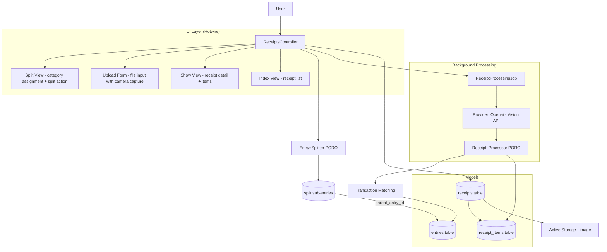
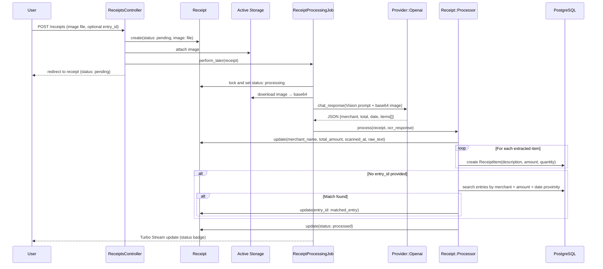
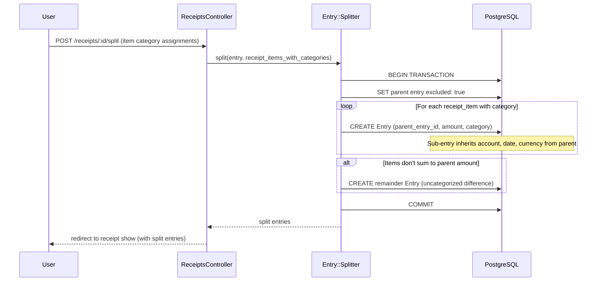

# Design Document: Receipt Scanning with Item-Level Categorization

## Overview

This feature allows users to photograph or upload receipts, extract line items via OCR using the OpenAI Vision API (already available via `ruby-openai` gem), match receipts to existing transactions, and optionally split transactions into item-level categories. The system introduces a `Receipt` model with Active Storage attachment, a `ReceiptItem` model for extracted line items, a background processing pipeline via Sidekiq, and an `Entry::Splitter` PORO for breaking a single transaction into multiple sub-entries by category.

Receipts belong optionally to an `Entry` (allowing upload before or after matching). Processing is asynchronous — the user uploads an image, a `ReceiptProcessingJob` sends it to OpenAI Vision for OCR, parses the structured response into `ReceiptItem` records, and attempts auto-matching to an existing transaction by merchant name, amount, and date proximity. Users can then review extracted items, assign categories, and split the parent transaction into sub-entries.

## Architecture



## Sequence Diagrams

### Receipt Upload and Processing Flow



### Transaction Splitting Flow



## Components and Interfaces

### Component 1: Receipt Model

**Purpose**: Stores receipt metadata, image attachment, and OCR results. Belongs to a Family (scoped via account's family through entry, or directly).

```ruby
# app/models/receipt.rb
class Receipt < ApplicationRecord
  belongs_to :family
  belongs_to :entry, optional: true

  has_many :receipt_items, dependent: :destroy
  has_one_attached :image

  enum :status, {
    pending: "pending",
    processing: "processing",
    processed: "processed",
    failed: "failed"
  }

  validates :status, presence: true
  validates :image, presence: true
  validate :image_content_type_valid

  scope :chronological, -> { order(created_at: :desc) }
  scope :unmatched, -> { where(entry_id: nil, status: :processed) }

  def matched?
    entry_id.present?
  end

  def total_items_amount
    receipt_items.sum(:amount)
  end

  def items_match_total?
    return false if total_amount.nil?
    (total_items_amount - total_amount).abs < 0.01
  end
end
```

**Responsibilities**:

- Store receipt image via Active Storage
- Track OCR processing status
- Hold extracted merchant name, total amount, receipt date, raw OCR text
- Associate with an Entry (transaction) when matched
- Scope to Family for multi-tenant isolation

### Component 2: ReceiptItem Model

**Purpose**: Stores individual line items extracted from a receipt via OCR.

```ruby
# app/models/receipt_item.rb
class ReceiptItem < ApplicationRecord
  belongs_to :receipt
  belongs_to :category, optional: true

  validates :description, :amount, presence: true
  validates :amount, numericality: { greater_than: 0 }
  validates :quantity, numericality: { greater_than: 0 }, allow_nil: true
end
```

**Responsibilities**:

- Store line item description, amount, quantity
- Optional category assignment for splitting
- Belong to a receipt for grouping

### Component 3: Receipt::Processor PORO

**Purpose**: Orchestrates OCR parsing and transaction matching after OpenAI Vision returns results.

```ruby
# app/models/receipt/processor.rb
class Receipt::Processor
  def initialize(receipt)
    @receipt = receipt
  end

  def process(ocr_response)
    parsed = parse_ocr_response(ocr_response)

    receipt.update!(
      merchant_name: parsed[:merchant],
      total_amount: parsed[:total],
      receipt_date: parsed[:date],
      raw_text: parsed[:raw_text],
      scanned_at: Time.current
    )

    create_items(parsed[:items])
    auto_match_entry unless receipt.entry_id.present?
  end

  private
    attr_reader :receipt

    def parse_ocr_response(response)
      # Parse structured JSON from OpenAI Vision response
    end

    def create_items(items)
      items.each do |item|
        receipt.receipt_items.create!(
          description: item[:description],
          amount: item[:amount],
          quantity: item[:quantity] || 1
        )
      end
    end

    def auto_match_entry
      # Search family entries by merchant name, amount proximity, date proximity
    end
end
```

### Component 4: Entry::Splitter PORO

**Purpose**: Splits a parent transaction entry into multiple sub-entries by category based on receipt items.

```ruby
# app/models/entry/splitter.rb
class Entry::Splitter
  def initialize(entry)
    @entry = entry
  end

  def split(items_with_categories)
    Entry.transaction do
      entry.update!(excluded: true)

      created_entries = items_with_categories.map do |item|
        entry.account.entries.create!(
          name: item[:description],
          date: entry.date,
          amount: item[:amount],
          currency: entry.currency,
          parent_entry_id: entry.id,
          entryable: Transaction.new(category_id: item[:category_id])
        )
      end

      handle_remainder(created_entries)
      created_entries
    end
  end

  private
    attr_reader :entry

    def handle_remainder(created_entries)
      split_total = created_entries.sum { |e| e.amount }
      remainder = entry.amount - split_total

      return if remainder.abs < 0.01

      entry.account.entries.create!(
        name: "#{entry.name} (remainder)",
        date: entry.date,
        amount: remainder,
        currency: entry.currency,
        parent_entry_id: entry.id,
        entryable: Transaction.new
      )
    end
end
```

### Component 5: ReceiptProcessingJob

**Purpose**: Async job that sends receipt image to OpenAI Vision API and triggers processing.

```ruby
# app/jobs/receipt_processing_job.rb
class ReceiptProcessingJob < ApplicationJob
  queue_as :medium_priority

  def perform(receipt)
    receipt.update!(status: :processing)

    llm = Provider::Registry.get_provider(:openai)
    raise "OpenAI provider not configured" unless llm

    image_data = base64_encode(receipt.image)
    response = llm.chat_response(
      build_vision_prompt(image_data),
      model: "gpt-4.1"
    )

    Receipt::Processor.new(receipt).process(response)
    receipt.update!(status: :processed)
  rescue => e
    receipt.update!(status: :failed)
    Rails.logger.error("Receipt processing failed: #{e.message}")
    raise e
  end
end
```

## Data Models

### Receipt

```ruby
# Migration: create_receipts
create_table :receipts, id: :uuid do |t|
  t.references :family, type: :uuid, null: false, foreign_key: true
  t.references :entry, type: :uuid, null: true, foreign_key: true
  t.string :status, null: false, default: "pending"
  t.string :merchant_name
  t.decimal :total_amount, precision: 19, scale: 4
  t.string :currency
  t.date :receipt_date
  t.text :raw_text
  t.datetime :scanned_at
  t.timestamps
end

add_index :receipts, [:family_id, :status]
add_index :receipts, [:entry_id], unique: true
```

**Validation Rules**:

- `status` must be one of: pending, processing, processed, failed
- `image` attachment must be present
- `image` content type must be image/jpeg, image/png, image/webp, or image/heic
- `total_amount` must be positive when present
- `entry_id` unique index (one receipt per entry)

### ReceiptItem

```ruby
# Migration: create_receipt_items
create_table :receipt_items, id: :uuid do |t|
  t.references :receipt, type: :uuid, null: false, foreign_key: true
  t.references :category, type: :uuid, null: true, foreign_key: true
  t.string :description, null: false
  t.decimal :amount, precision: 19, scale: 4, null: false
  t.integer :quantity, default: 1
  t.timestamps
end

add_index :receipt_items, :receipt_id
```

**Validation Rules**:

- `description` and `amount` are required
- `amount` must be greater than 0
- `quantity` must be greater than 0 when present

### Entry (migration to add parent_entry_id)

```ruby
# Migration: add_parent_entry_id_to_entries
add_reference :entries, :parent_entry, type: :uuid, null: true, foreign_key: { to_table: :entries }
```

## Key Functions with Formal Specifications

### Function 1: Receipt::Processor#auto_match_entry

```ruby
def auto_match_entry
```

**Preconditions:**

- `receipt.entry_id` is nil
- `receipt.merchant_name` is present
- `receipt.total_amount` is present
- `receipt.family` is present

**Postconditions:**

- If a matching entry is found: `receipt.entry_id` is set to the matched entry's id
- If no match found: `receipt.entry_id` remains nil
- Match criteria: same family, merchant name similarity, amount within 5% tolerance, date within 7 days of receipt_date
- At most one entry is matched (best match by date proximity)

### Function 2: Entry::Splitter#split

```ruby
def split(items_with_categories)
```

**Preconditions:**

- `entry` is a Transaction-type entry (not Valuation or Trade)
- `entry` has no existing child entries (parent_entry_id references)
- `items_with_categories` is a non-empty array of {description, amount, category_id}
- Sum of item amounts does not exceed `entry.amount.abs`

**Postconditions:**

- Parent entry is marked `excluded: true`
- One sub-entry created per item, each with `parent_entry_id` = parent entry id
- Each sub-entry inherits `account_id`, `date`, `currency` from parent
- If items don't sum to parent amount, a remainder entry is created
- All sub-entries are Transaction type with assigned categories
- Total of sub-entry amounts equals parent entry amount exactly
- Account sync is triggered after split

### Function 3: Receipt::Processor#parse_ocr_response

```ruby
def parse_ocr_response(response)
```

**Preconditions:**

- `response` is a valid response from OpenAI Vision API
- Response contains parseable text content

**Postconditions:**

- Returns hash with keys: `merchant`, `total`, `date`, `items`, `raw_text`
- `items` is an array of hashes with `description`, `amount`, `quantity`
- All amounts are positive decimals
- `date` is a Date object or nil if unparseable
- Invalid/unparseable items are skipped (not included in result)

## Algorithmic Pseudocode

### Receipt Processing Pipeline

```pascal
ALGORITHM processReceipt(receipt)
INPUT: receipt with attached image
OUTPUT: processed receipt with items and optional entry match

BEGIN
  ASSERT receipt.image IS PRESENT
  ASSERT receipt.status = "pending"

  receipt.status ← "processing"
  SAVE receipt

  // Step 1: Extract image data
  image_base64 ← encode_base64(receipt.image.download)

  // Step 2: Send to OpenAI Vision API
  prompt ← build_structured_prompt(image_base64)
  response ← openai.chat_response(prompt, model: "gpt-4.1")

  // Step 3: Parse structured response
  parsed ← parse_json_response(response)
  ASSERT parsed.merchant IS String
  ASSERT parsed.total IS Decimal AND parsed.total > 0

  // Step 4: Update receipt metadata
  receipt.merchant_name ← parsed.merchant
  receipt.total_amount ← parsed.total
  receipt.receipt_date ← parsed.date
  receipt.raw_text ← parsed.raw_text
  receipt.scanned_at ← NOW()

  // Step 5: Create line items
  FOR each item IN parsed.items DO
    ASSERT item.amount > 0
    receipt.receipt_items.CREATE(
      description: item.description,
      amount: item.amount,
      quantity: item.quantity OR 1
    )
  END FOR

  // Step 6: Auto-match to existing transaction
  IF receipt.entry_id IS NULL THEN
    candidates ← family.entries
      .WHERE(entryable_type = "Transaction")
      .WHERE(date BETWEEN receipt.receipt_date - 7.days AND receipt.receipt_date + 7.days)
      .WHERE(amount BETWEEN total * 0.95 AND total * 1.05)

    IF candidates.COUNT > 0 THEN
      best_match ← candidates.ORDER_BY(ABS(date - receipt.receipt_date)).FIRST
      receipt.entry_id ← best_match.id
    END IF
  END IF

  receipt.status ← "processed"
  SAVE receipt

  RETURN receipt
END
```

### Transaction Splitting Algorithm

```pascal
ALGORITHM splitEntry(entry, items_with_categories)
INPUT: parent entry, array of {description, amount, category_id}
OUTPUT: array of created sub-entries

BEGIN
  ASSERT entry.entryable_type = "Transaction"
  ASSERT entry has no child entries
  ASSERT items_with_categories IS NOT EMPTY
  ASSERT SUM(items.amount) <= ABS(entry.amount)

  BEGIN TRANSACTION
    // Step 1: Exclude parent from calculations
    entry.excluded ← true
    SAVE entry

    // Step 2: Determine amount sign (preserve inflow/outflow convention)
    sign ← IF entry.amount >= 0 THEN 1 ELSE -1

    created_entries ← []

    // Step 3: Create sub-entries for each item
    FOR each item IN items_with_categories DO
      sub_entry ← Entry.CREATE(
        account_id: entry.account_id,
        name: item.description,
        date: entry.date,
        amount: item.amount * sign,
        currency: entry.currency,
        parent_entry_id: entry.id,
        entryable: Transaction.new(category_id: item.category_id)
      )
      created_entries.APPEND(sub_entry)
    END FOR

    // Step 4: Handle remainder
    split_total ← SUM(created_entries.amount)
    remainder ← entry.amount - split_total

    IF ABS(remainder) >= 0.01 THEN
      remainder_entry ← Entry.CREATE(
        account_id: entry.account_id,
        name: entry.name + " (remainder)",
        date: entry.date,
        amount: remainder,
        currency: entry.currency,
        parent_entry_id: entry.id,
        entryable: Transaction.new
      )
      created_entries.APPEND(remainder_entry)
    END IF
  COMMIT TRANSACTION

  // Step 5: Trigger account sync
  entry.account.sync_later

  RETURN created_entries
END
```

## Example Usage

```ruby
# Example 1: Upload a receipt
receipt = Current.family.receipts.create!(
  image: uploaded_file,
  status: :pending
)
ReceiptProcessingJob.perform_later(receipt)

# Example 2: Upload and attach to existing transaction
receipt = Current.family.receipts.create!(
  image: uploaded_file,
  entry: entry,
  status: :pending
)
ReceiptProcessingJob.perform_later(receipt)

# Example 3: Split a transaction by receipt items
splitter = Entry::Splitter.new(entry)
sub_entries = splitter.split([
  { description: "Groceries", amount: 45.99, category_id: food_category.id },
  { description: "Cleaning supplies", amount: 12.50, category_id: home_category.id }
])

# Example 4: Manual match after processing
receipt.update!(entry: matched_entry)

# Example 5: Reprocess a failed receipt
ReceiptProcessingJob.perform_later(receipt) if receipt.failed?
```

## Error Handling

### Error Scenario 1: OpenAI Vision API Failure

**Condition**: OpenAI API returns an error or times out during OCR processing
**Response**: Receipt status set to `failed`, error logged with Sentry, job raises to trigger Sidekiq retry
**Recovery**: User can manually trigger reprocessing; Sidekiq retries up to 3 times with exponential backoff

### Error Scenario 2: Unparseable OCR Response

**Condition**: OpenAI returns a response but the JSON structure is invalid or missing required fields
**Response**: Receipt status set to `failed`, raw response stored in `raw_text` for debugging
**Recovery**: User can view raw text and manually enter items; reprocessing available

### Error Scenario 3: No OpenAI Provider Configured

**Condition**: `Provider::Registry.get_provider(:openai)` returns nil (no API key set)
**Response**: Job fails immediately with descriptive error, receipt stays `pending`
**Recovery**: Admin configures OpenAI access token in settings; user retries upload

### Error Scenario 4: Split Amount Exceeds Parent

**Condition**: Sum of split item amounts exceeds the parent entry's absolute amount
**Response**: `Entry::Splitter` raises `ArgumentError` before creating any entries
**Recovery**: User adjusts item amounts in the split form; validation shown in UI

### Error Scenario 5: Image Too Large or Invalid Format

**Condition**: Uploaded file exceeds size limit or is not a supported image type
**Response**: ActiveRecord validation error on Receipt, no job enqueued
**Recovery**: User uploads a smaller or correctly formatted image

## Testing Strategy

### Unit Testing Approach

- `Receipt` model: validations, scopes, status transitions, `matched?`, `total_items_amount`, `items_match_total?`
- `ReceiptItem` model: validations, associations
- `Receipt::Processor`: OCR response parsing, item creation, auto-matching logic (mock OpenAI responses)
- `Entry::Splitter`: split creation, remainder handling, amount sign preservation, parent exclusion, edge cases
- All tests use Minitest + fixtures following project conventions

### Property-Based Testing Approach

**Property Test Library**: minitest-proptest or custom generators

- Split integrity: for any entry and valid item set, sum of sub-entry amounts equals parent amount
- Amount sign preservation: sub-entries preserve the inflow/outflow sign of the parent
- OCR parsing robustness: for any valid JSON structure, parser extracts expected fields without raising

### Integration Testing Approach

- Controller tests: upload flow, show/index scoping to Current.family, split action
- Job tests: full processing pipeline with VCR cassettes for OpenAI responses
- System tests: upload via file input, view processed receipt, split transaction (if applicable)

## Security Considerations

- Receipt images scoped to `Current.family` — users cannot access other families' receipts
- Active Storage URLs use signed, expiring URLs (Rails default)
- OpenAI API key stored in encrypted settings, never exposed to client
- File upload validation: content type whitelist (JPEG, PNG, WebP, HEIC), size limit (10MB)
- Receipt data (merchant, amounts) treated as user financial data — same access controls as transactions

## Performance Considerations

- OCR processing is async (Sidekiq) — no blocking on upload
- Image stored via Active Storage with variants for thumbnails (avoid sending full-res to browser)
- Receipt list uses pagination and eager-loads `receipt_items` to avoid N+1
- Auto-matching query uses indexed columns (family_id, date, amount) for efficient lookup
- Base64 encoding of large images handled in job worker memory, not in web process

## Dependencies

- `ruby-openai` gem (already installed) — OpenAI Vision API for OCR
- Active Storage (already configured) — image attachment storage
- Sidekiq (already configured) — background job processing
- No new gems required
