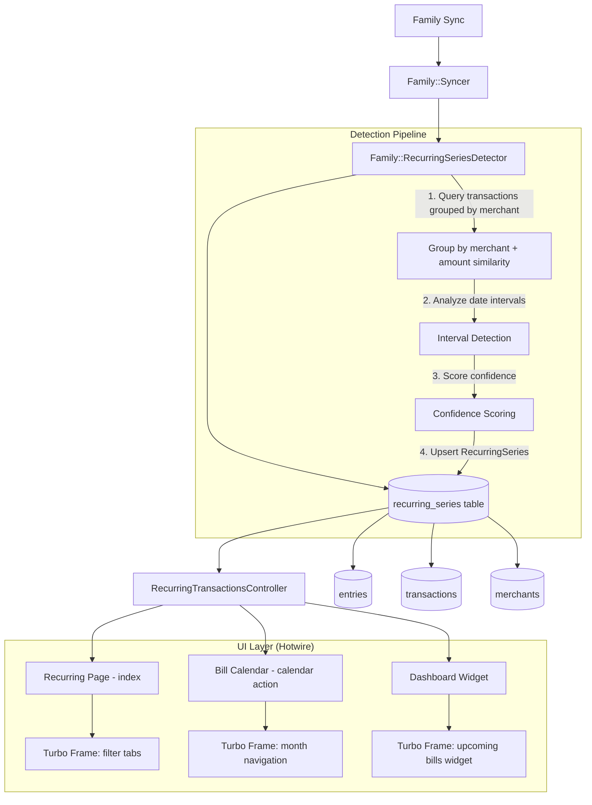
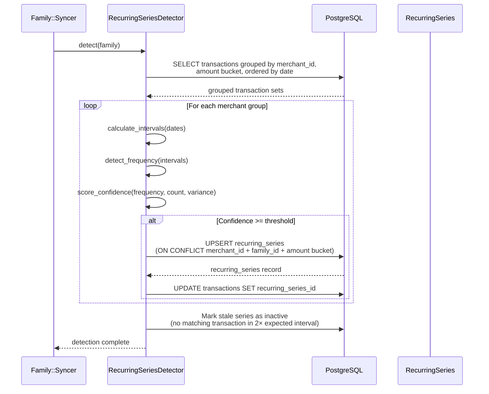
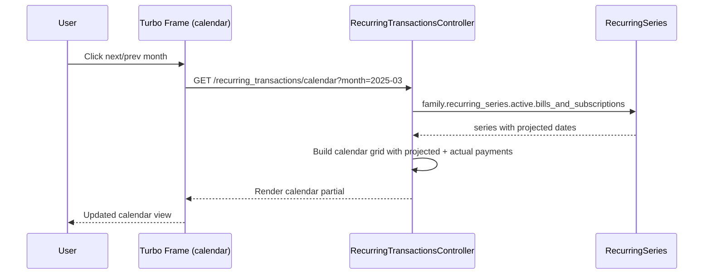

# Design Document: Recurring Transactions / Subscription Detection

## Overview

This feature adds automatic detection of recurring transactions (bills, subscriptions, recurring income) from a family's transaction history. The system scans transactions grouped by merchant and identifies patterns — same merchant, similar amounts, regular intervals — to surface recurring financial commitments.

The feature introduces a new `RecurringSeries` model owned by `Family`, a dedicated "Recurring" page with grouped views (bills, subscriptions, income), a bill calendar with month navigation via Turbo frames, and a dashboard widget surfacing upcoming payments. Detection runs as part of the existing family sync pipeline via a new `Family::RecurringSeriesDetector` PORO, following the same pattern as `Family::AutoCategorizer` and `Family::AutoMerchantDetector`.

Users can also manually create recurring series or override auto-detected ones (mark as cancelled, adjust frequency). The system re-evaluates detection on each family sync to pick up new patterns and update existing ones.

## Architecture



## Sequence Diagrams

### Detection Flow (during Family Sync)



### Bill Calendar Navigation



## Components and Interfaces

### Component 1: RecurringSeries (Model)

**Purpose**: Represents a detected or manually created recurring financial pattern. Belongs to a Family, optionally linked to a Merchant and Category.

```ruby
# app/models/recurring_series.rb
class RecurringSeries < ApplicationRecord
  include Monetizable

  belongs_to :family
  belongs_to :merchant, optional: true
  belongs_to :category, optional: true

  has_many :transactions

  monetize :average_amount

  enum :frequency, {
    weekly: "weekly",
    biweekly: "biweekly",
    monthly: "monthly",
    quarterly: "quarterly",
    semi_annual: "semi_annual",
    annual: "annual"
  }

  enum :series_type, {
    bill: "bill",
    subscription: "subscription",
    income: "income"
  }

  enum :status, {
    active: "active",
    cancelled: "cancelled",
    paused: "paused"
  }

  scope :active, -> { where(status: "active") }
  scope :bills_and_subscriptions, -> { where(series_type: %w[bill subscription]) }
  scope :incomes, -> { where(series_type: "income") }
  scope :due_within, ->(days) { active.bills_and_subscriptions.where(next_expected_date: ..days.from_now.to_date) }

  validates :title, :frequency, :series_type, :status, :average_amount, :currency, presence: true

  def overdue?
    active? && next_expected_date.present? && next_expected_date < Date.current
  end

  def upcoming?(within_days: 7)
    active? && next_expected_date.present? &&
      next_expected_date.between?(Date.current, within_days.days.from_now.to_date)
  end

  def monthly_cost
    # Normalize any frequency to monthly equivalent
  end

  def annual_cost
    monthly_cost * 12
  end

  def projected_dates_in_range(start_date, end_date)
    # Generate expected payment dates within a date range
  end
end
```

**Responsibilities**:

- Store detected recurring pattern metadata (frequency, amount, dates)
- Calculate projected future payment dates
- Normalize costs to monthly/annual totals
- Track status (active, cancelled, paused)
- Classify as bill, subscription, or income

### Component 2: Family::RecurringSeriesDetector (PORO)

**Purpose**: Analyzes a family's transaction history to detect recurring patterns. Runs during family sync, following the same pattern as `Family::AutoCategorizer`.

```ruby
# app/models/family/recurring_series_detector.rb
class Family::RecurringSeriesDetector
  MINIMUM_OCCURRENCES = 3
  AMOUNT_TOLERANCE = 0.15        # 15% variance allowed
  CONFIDENCE_THRESHOLD = 0.6
  STALE_MULTIPLIER = 2.5         # Mark stale if no tx in 2.5× expected interval

  FREQUENCY_RANGES = {
    weekly:      { min: 5, max: 9 },
    biweekly:    { min: 12, max: 16 },
    monthly:     { min: 25, max: 35 },
    quarterly:   { min: 80, max: 100 },
    semi_annual: { min: 170, max: 195 },
    annual:      { min: 350, max: 380 }
  }.freeze

  def initialize(family)
    @family = family
  end

  def detect
    # 1. Group candidate transactions
    # 2. Analyze each group for recurrence
    # 3. Upsert RecurringSeries records
    # 4. Mark stale series as inactive
  end
end
```

**Responsibilities**:

- Query and group transactions by merchant + amount similarity
- Calculate intervals between consecutive transactions
- Detect frequency (weekly through annual)
- Score confidence based on regularity, count, and amount variance
- Upsert `RecurringSeries` records (create new, update existing)
- Mark series as stale/inactive when pattern breaks

### Component 3: RecurringTransactionsController

**Purpose**: Thin controller serving the Recurring page, calendar view, and dashboard widget.

```ruby
# app/controllers/recurring_transactions_controller.rb
class RecurringTransactionsController < ApplicationController
  def index
    # Main recurring page with filter tabs (all, bills, subscriptions, income)
    @recurring_series = Current.family.recurring_series
                          .includes(:merchant, :category)
                          .active
                          .order(:next_expected_date)
    @filter = params[:filter] || "all"
  end

  def calendar
    # Bill calendar view with month navigation via Turbo frame
    @month = params[:month] ? Date.parse(params[:month]) : Date.current.beginning_of_month
    @series = Current.family.recurring_series.active.bills_and_subscriptions
  end

  def show
    # Detail view for a single recurring series with transaction history
    @recurring_series = Current.family.recurring_series.find(params[:id])
  end

  def new
    # Manual creation form
  end

  def create
    # Manual creation
  end

  def update
    # Edit series (mark cancelled, change type, etc.)
  end

  def destroy
    # Delete a recurring series
  end
end
```

**Responsibilities**:

- Serve filtered lists of recurring series
- Build calendar data for bill calendar view
- Handle CRUD for manual recurring series management

## Data Models

### RecurringSeries

```ruby
# db/migrate/XXXXXX_create_recurring_series.rb
create_table :recurring_series, id: :uuid, default: -> { "gen_random_uuid()" } do |t|
  t.references :family, null: false, foreign_key: true, type: :uuid
  t.references :merchant, foreign_key: true, type: :uuid
  t.references :category, foreign_key: true, type: :uuid

  t.string :title, null: false
  t.string :frequency, null: false          # weekly, biweekly, monthly, quarterly, semi_annual, annual
  t.string :series_type, null: false        # bill, subscription, income
  t.string :status, default: "active", null: false  # active, cancelled, paused

  t.decimal :average_amount, precision: 19, scale: 4, null: false
  t.string :currency, null: false

  t.date :last_observed_date               # Date of most recent matching transaction
  t.date :next_expected_date               # Projected next occurrence
  t.date :first_observed_date              # Date of earliest matching transaction

  t.float :confidence, default: 0.0        # Detection confidence score (0.0 - 1.0)
  t.boolean :auto_detected, default: true   # false if manually created

  t.timestamps

  t.index [:family_id, :merchant_id, :series_type], name: "idx_recurring_series_family_merchant_type"
  t.index [:family_id, :status], name: "idx_recurring_series_family_status"
  t.index [:family_id, :next_expected_date], name: "idx_recurring_series_family_next_date"
end
```

**Validation Rules**:

- `title`, `frequency`, `series_type`, `status`, `average_amount`, `currency` are required (DB NOT NULL)
- `frequency` must be one of the defined enum values
- `series_type` must be one of: bill, subscription, income
- `status` must be one of: active, cancelled, paused
- `average_amount` must be positive
- Unique constraint: one active series per family + merchant + series_type combination

### Transaction Extension

```ruby
# Add recurring_series_id to transactions table
add_reference :transactions, :recurring_series, type: :uuid, foreign_key: true, index: true
```

This links individual transactions back to their detected recurring series, enabling the "transaction history" view on a series detail page.

## Algorithmic Pseudocode

### Main Detection Algorithm

```ruby
# Family::RecurringSeriesDetector#detect
def detect
  candidate_groups = group_transactions_by_merchant_and_amount
  detected_series = []

  candidate_groups.each do |group_key, transactions|
    next if transactions.size < MINIMUM_OCCURRENCES

    sorted_dates = transactions.map { |t| t.entry.date }.sort
    intervals = sorted_dates.each_cons(2).map { |a, b| (b - a).to_i }

    frequency = detect_frequency(intervals)
    next unless frequency

    confidence = calculate_confidence(
      intervals: intervals,
      frequency: frequency,
      transaction_count: transactions.size
    )
    next if confidence < CONFIDENCE_THRESHOLD

    average_amount = transactions.sum { |t| t.entry.amount.abs } / transactions.size
    series_type = infer_series_type(transactions)

    series = upsert_series(
      merchant: group_key[:merchant],
      frequency: frequency,
      series_type: series_type,
      average_amount: average_amount,
      confidence: confidence,
      first_date: sorted_dates.first,
      last_date: sorted_dates.last,
      transactions: transactions
    )

    detected_series << series
  end

  mark_stale_series(detected_series)
  detected_series
end
```

**Preconditions:**

- `family` has at least one account with transactions
- Transactions have been synced and enriched (merchants assigned)

**Postconditions:**

- All qualifying transaction groups have corresponding `RecurringSeries` records
- Each series has `next_expected_date` calculated from `last_observed_date` + frequency interval
- Stale series (no matching transaction in 2.5× expected interval) are marked inactive
- Transaction records are linked to their series via `recurring_series_id`

### Transaction Grouping Algorithm

```ruby
# Family::RecurringSeriesDetector#group_transactions_by_merchant_and_amount
def group_transactions_by_merchant_and_amount
  # Only consider transactions with assigned merchants, from the last 2 years
  scope = family.transactions
    .visible
    .joins(:entry)
    .where.not(merchant_id: nil)
    .where(entries: { date: 2.years.ago.to_date.. })
    .includes(:entry, :merchant)
    .order("entries.date ASC")

  # Group by merchant, then sub-group by amount similarity
  groups = {}

  scope.group_by(&:merchant_id).each do |merchant_id, txns|
    amount_buckets = bucket_by_amount(txns)

    amount_buckets.each_with_index do |bucket, idx|
      key = { merchant: txns.first.merchant, bucket_index: idx }
      groups[key] = bucket
    end
  end

  groups
end
```

**Preconditions:**

- Transactions have `merchant_id` assigned (via auto-detection or manual)
- Entries have valid `date` and `amount` fields

**Postconditions:**

- Returns hash of `{ merchant, bucket_index } => [transactions]`
- Each bucket contains transactions with amounts within `AMOUNT_TOLERANCE` of each other
- Transactions are sorted chronologically within each bucket

**Loop Invariants:**

- All transactions in a bucket share the same `merchant_id`
- Amount variance within a bucket ≤ `AMOUNT_TOLERANCE` (15%)

### Frequency Detection Algorithm

```ruby
# Family::RecurringSeriesDetector#detect_frequency
def detect_frequency(intervals)
  return nil if intervals.empty?

  median_interval = intervals.sort[intervals.size / 2]

  FREQUENCY_RANGES.each do |frequency, range|
    if median_interval.between?(range[:min], range[:max])
      return frequency
    end
  end

  nil # No matching frequency pattern
end
```

**Preconditions:**

- `intervals` is a non-empty array of positive integers (days between consecutive transactions)

**Postconditions:**

- Returns a frequency symbol if median interval falls within a known range
- Returns `nil` if no frequency pattern matches

### Confidence Scoring Algorithm

```ruby
# Family::RecurringSeriesDetector#calculate_confidence
def calculate_confidence(intervals:, frequency:, transaction_count:)
  expected_interval = expected_days_for(frequency)

  # Factor 1: Interval regularity (how consistent are the gaps?)
  deviations = intervals.map { |i| (i - expected_interval).abs.to_f / expected_interval }
  avg_deviation = deviations.sum / deviations.size
  regularity_score = [1.0 - avg_deviation, 0.0].max

  # Factor 2: Sample size (more occurrences = higher confidence)
  count_score = [transaction_count / 6.0, 1.0].min

  # Factor 3: Recency (more recent = higher confidence)
  # Handled externally via stale detection

  # Weighted combination
  (regularity_score * 0.7) + (count_score * 0.3)
end
```

**Preconditions:**

- `intervals` is non-empty
- `frequency` is a valid frequency symbol
- `transaction_count` ≥ `MINIMUM_OCCURRENCES` (3)

**Postconditions:**

- Returns a float between 0.0 and 1.0
- Score ≥ 0.6 indicates sufficient confidence for detection
- Regularity contributes 70% of score, sample size 30%

### Series Type Inference

```ruby
# Family::RecurringSeriesDetector#infer_series_type
def infer_series_type(transactions)
  # Use entry amount sign convention: negative = inflow, positive = outflow
  sample = transactions.first.entry

  if sample.amount.negative?
    :income
  else
    # Heuristic: subscriptions tend to be smaller, fixed amounts
    # Bills tend to be larger or variable (utilities)
    avg = transactions.sum { |t| t.entry.amount.abs } / transactions.size
    amount_variance = transactions.map { |t| (t.entry.amount.abs - avg).abs }.max / avg

    amount_variance < 0.05 ? :subscription : :bill
  end
end
```

**Preconditions:**

- `transactions` is non-empty, all from the same merchant

**Postconditions:**

- Returns `:income` for inflow transactions (negative amounts)
- Returns `:subscription` for outflow with very low amount variance (< 5%)
- Returns `:bill` for outflow with higher amount variance

### Projected Date Calculation

```ruby
# RecurringSeries#projected_dates_in_range
def projected_dates_in_range(start_date, end_date)
  return [] unless active? && last_observed_date.present?

  interval = frequency_interval_days
  dates = []
  current = next_expected_date || last_observed_date + interval

  # Walk backwards if current is after start_date
  while current > start_date
    current -= interval
  end
  current += interval if current < start_date

  while current <= end_date
    dates << current
    current += interval
  end

  dates
end

def frequency_interval_days
  case frequency
  when "weekly"      then 7
  when "biweekly"    then 14
  when "monthly"     then 30
  when "quarterly"   then 91
  when "semi_annual" then 182
  when "annual"      then 365
  end
end
```

**Preconditions:**

- `start_date` ≤ `end_date`
- Series is active with a valid `last_observed_date`

**Postconditions:**

- Returns array of `Date` objects within the given range
- Dates are spaced by the series frequency interval
- For monthly frequency, uses 30-day approximation (calendar-aware version in implementation)

## Key Functions with Formal Specifications

### Function: RecurringSeries#monthly_cost

```ruby
def monthly_cost
  multiplier = case frequency
  when "weekly"      then 52.0 / 12
  when "biweekly"    then 26.0 / 12
  when "monthly"     then 1.0
  when "quarterly"   then 1.0 / 3
  when "semi_annual" then 1.0 / 6
  when "annual"      then 1.0 / 12
  end

  average_amount.abs * multiplier
end
```

**Preconditions:**

- `average_amount` is present and non-zero
- `frequency` is a valid enum value

**Postconditions:**

- Returns a positive decimal representing monthly cost in the series currency
- Weekly: amount × 4.33; Biweekly: amount × 2.17; Monthly: amount × 1; etc.

### Function: Family::RecurringSeriesDetector#bucket_by_amount

```ruby
def bucket_by_amount(transactions)
  buckets = []

  transactions.sort_by { |t| t.entry.amount.abs }.each do |txn|
    amount = txn.entry.amount.abs
    placed = false

    buckets.each do |bucket|
      bucket_avg = bucket.sum { |t| t.entry.amount.abs } / bucket.size
      if (amount - bucket_avg).abs / bucket_avg <= AMOUNT_TOLERANCE
        bucket << txn
        placed = true
        break
      end
    end

    buckets << [txn] unless placed
  end

  buckets
end
```

**Preconditions:**

- `transactions` is non-empty, all share the same `merchant_id`
- Each transaction has a valid `entry.amount`

**Postconditions:**

- Returns array of arrays, each sub-array is a "bucket" of similar amounts
- All transactions in a bucket have amounts within 15% of the bucket average
- Every input transaction appears in exactly one bucket

**Loop Invariants:**

- At each iteration, all existing buckets maintain internal amount consistency (≤ 15% variance)
- No transaction is placed in more than one bucket

## Example Usage

```ruby
# Detection runs automatically during family sync
# In Family::Syncer#perform_sync:
Family::RecurringSeriesDetector.new(family).detect

# Manual creation of a recurring series
series = Current.family.recurring_series.create!(
  title: "Netflix",
  frequency: :monthly,
  series_type: :subscription,
  status: :active,
  average_amount: 15.99,
  currency: "USD",
  auto_detected: false,
  next_expected_date: Date.new(2025, 2, 15)
)

# Query upcoming bills for dashboard widget
upcoming = Current.family.recurring_series.due_within(7)
# => [#<RecurringSeries title: "Netflix", next_expected_date: "2025-02-15">, ...]

# Get monthly totals for the recurring page
total_monthly = Current.family.recurring_series.active.bills_and_subscriptions.sum(&:monthly_cost)
total_annual = total_monthly * 12

# Calendar: get projected dates for March 2025
series.projected_dates_in_range(
  Date.new(2025, 3, 1),
  Date.new(2025, 3, 31)
)
# => [#<Date: 2025-03-15>]

# Mark a subscription as cancelled
series.update!(status: :cancelled)

# Filter by type on the recurring page
Current.family.recurring_series.active.where(series_type: "subscription")
```

## Correctness Properties

_A property is a characteristic or behavior that should hold true across all valid executions of a system — essentially, a formal statement about what the system should do. Properties serve as the bridge between human-readable specifications and machine-verifiable correctness guarantees._

### Property 1: Required field validation

_For any_ RecurringSeries, creating a record with any required field (title, frequency, series_type, status, average_amount, currency) missing SHALL be rejected by validation, and only valid enum values SHALL be accepted for frequency, series_type, and status.

**Validates: Requirements 1.1, 1.2, 1.3, 1.4, 1.5**

### Property 2: Monthly cost normalization correctness

_For any_ valid RecurringSeries with a positive average_amount and any valid frequency, monthly_cost SHALL equal average_amount multiplied by the correct frequency multiplier, annual_cost SHALL equal monthly_cost × 12, and monthly_cost SHALL always be positive.

**Validates: Requirements 2.1, 2.2, 2.3**

### Property 3: Overdue status correctness

_For any_ RecurringSeries that is active with a next_expected_date before the current date, overdue? SHALL return true. For any non-active series, overdue? SHALL return false regardless of dates.

**Validates: Requirements 3.1, 3.3**

### Property 4: Upcoming status correctness

_For any_ RecurringSeries that is active with a next_expected_date within the specified day range, upcoming? SHALL return true. For any non-active series, upcoming? SHALL return false regardless of dates.

**Validates: Requirements 3.2, 3.3**

### Property 5: Amount bucketing integrity

_For any_ set of transactions from the same merchant, the bucket_by_amount algorithm SHALL place every transaction into exactly one bucket, and all transactions within a bucket SHALL have amounts within 15% of the bucket average.

**Validates: Requirements 4.2, 4.3**

### Property 6: Minimum occurrence threshold

_For any_ group of transactions with fewer than 3 entries, the Detector SHALL not create a RecurringSeries for that group.

**Validates: Requirements 4.4, 15.2**

### Property 7: Frequency detection from median interval

_For any_ array of positive integer intervals, detect_frequency SHALL return the correct frequency when the median falls within a defined range, and SHALL return nil when the median falls outside all defined ranges.

**Validates: Requirements 5.2, 5.3**

### Property 8: Confidence score bounds

_For any_ valid inputs to calculate_confidence (non-empty intervals, valid frequency, transaction_count ≥ 3), the returned Confidence_Score SHALL be between 0.0 and 1.0 inclusive.

**Validates: Requirements 6.1**

### Property 9: Auto-detected confidence invariant

_For any_ auto-detected RecurringSeries in the database, the confidence score SHALL be at least 0.6.

**Validates: Requirements 6.3, 6.4**

### Property 10: Series type inference correctness

_For any_ group of transactions, infer_series_type SHALL return :income for inflow transactions (negative amounts), :subscription for outflow transactions with amount variance below 5%, and :bill for outflow transactions with amount variance at or above 5%.

**Validates: Requirements 7.1, 7.2, 7.3**

### Property 11: Detection idempotency

_For any_ set of transaction data, running the Detector twice SHALL produce the same set of RecurringSeries records with no duplicates for the same family, merchant, and series_type combination.

**Validates: Requirements 8.2, 9.1, 9.2**

### Property 12: Transaction linking after detection

_For any_ detection run, all transactions that were part of a detected recurring group SHALL have their recurring_series_id set to the corresponding RecurringSeries.

**Validates: Requirement 8.3**

### Property 13: Stale series pausing

_For any_ active RecurringSeries where the time since last_observed_date exceeds 2.5× the expected frequency interval, the Detector SHALL update the series status to paused.

**Validates: Requirements 8.4, 15.3**

### Property 14: Projected dates within range

_For any_ active RecurringSeries and any date range [start, end], projected_dates_in_range SHALL return only dates that fall within [start, end], spaced by the series frequency interval. For inactive series or series without last_observed_date, it SHALL return an empty list.

**Validates: Requirements 10.1, 10.2, 10.3**

### Property 15: Family scoping security

_For any_ controller action and any two families A and B, family A SHALL not be able to access, modify, or delete RecurringSeries belonging to family B.

**Validates: Requirement 14.4**

## Error Handling

### Error Scenario 1: No Transactions with Merchants

**Condition**: Family has transactions but none have assigned merchants (merchant_id is NULL for all).
**Response**: Detection completes with no results. No error raised.
**Recovery**: Once merchants are assigned (via auto-detection or manual), next sync will detect patterns.

### Error Scenario 2: Insufficient Transaction History

**Condition**: Family has fewer than `MINIMUM_OCCURRENCES` (3) transactions for any merchant.
**Response**: No series detected for that merchant. Existing series remain unchanged.
**Recovery**: As more transactions accumulate over time, detection will eventually trigger.

### Error Scenario 3: Detection Fails Mid-Sync

**Condition**: An exception occurs during `RecurringSeriesDetector#detect`.
**Response**: Error is logged and reported to Sentry. The sync continues (detection is non-critical). Existing series remain unchanged.
**Recovery**: Next sync will retry detection. Wrap in rescue block like `Account::MarketDataImporter`.

### Error Scenario 4: Stale Series with Active Status

**Condition**: A series hasn't had a matching transaction in 2.5× the expected interval.
**Response**: Series `status` is updated to `"paused"` automatically during detection.
**Recovery**: If a matching transaction appears later, the series is reactivated.

## Testing Strategy

### Unit Testing Approach

- Test `RecurringSeriesDetector` with fixture data covering each frequency type
- Test `detect_frequency` with known interval arrays
- Test `calculate_confidence` with varying regularity and sample sizes
- Test `bucket_by_amount` with amounts at boundary of tolerance
- Test `RecurringSeries#monthly_cost` for each frequency
- Test `RecurringSeries#projected_dates_in_range` for edge cases (empty range, single date, spanning year boundary)
- Test `infer_series_type` for income vs bill vs subscription classification
- Use Minitest + fixtures (never RSpec or FactoryBot)

### Property-Based Testing Approach

**Property Test Library**: None required — use Minitest assertions with generated data.

Key properties to test:

- For any valid frequency, `monthly_cost * 12 == annual_cost`
- For any set of projected dates, all dates fall within the requested range
- Bucket algorithm places every transaction in exactly one bucket
- Confidence score is always between 0.0 and 1.0
- Detection is idempotent (running twice yields same results)

### Integration Testing Approach

- Test full detection pipeline: create transactions with known patterns → run detector → verify series created
- Test sync integration: verify detection runs as part of `Family::Syncer`
- Test controller actions: verify index, calendar, show render correctly with fixture data
- Test dashboard widget: verify upcoming bills appear on dashboard
- Test Turbo frame navigation: calendar month switching returns correct frame

## Performance Considerations

- Detection queries should be scoped to last 2 years of transactions to bound the dataset
- Group-by-merchant query uses existing `merchant_id` index on transactions table
- Add composite index on `(family_id, status, next_expected_date)` for dashboard widget queries
- Detection runs during family sync (background job), so it doesn't block the UI
- Calendar view projects dates in-memory (no DB query per date) — bounded by 31 days max
- Use `includes(:merchant, :category)` on recurring series queries to avoid N+1

## Security Considerations

- All queries are scoped to `Current.family` — no cross-family data leakage
- Controller uses existing authentication concern (same as other controllers)
- Manual creation validates that referenced merchant/category belongs to the same family
- No external API calls — detection is purely local computation on existing transaction data

## Dependencies

- No new gems required
- Relies on existing models: `Family`, `Transaction`, `Entry`, `Merchant`, `Category`
- Relies on existing sync infrastructure: `Syncable` concern, `Family::Syncer`, `SyncJob`
- Relies on existing UI infrastructure: Turbo frames, DS components, TailwindCSS design tokens
