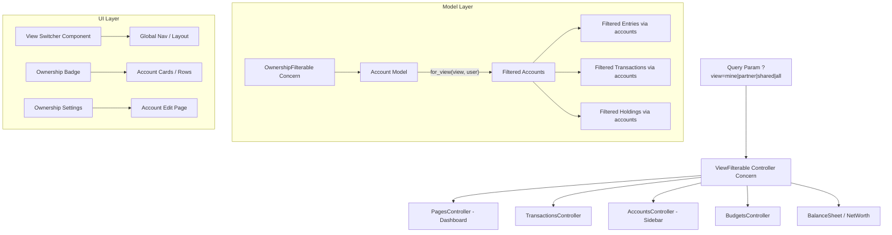
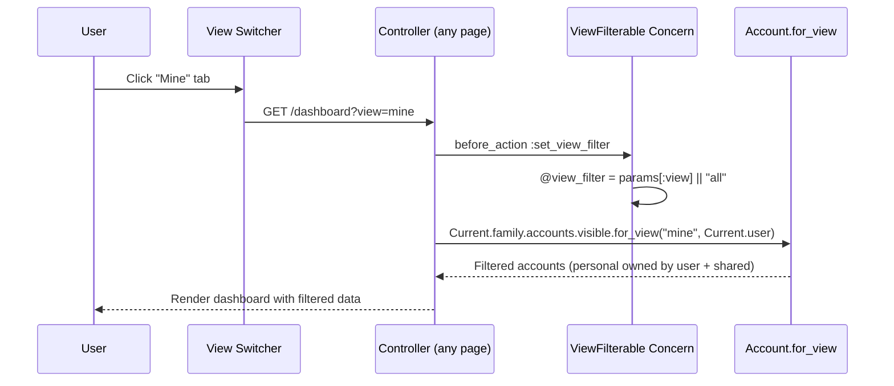
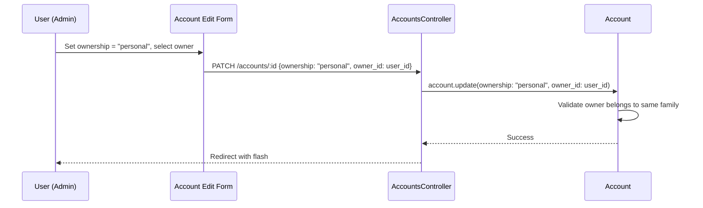

# Design Document: Shared Views with Yours/Mine/Ours Labeling

## Overview

This feature lets partners in a Family label accounts as "personal" (mine) or "shared" (ours). A global view filter — accessible from the main nav — lets users see finances from different perspectives: All, Mine, Partner's, or Shared Only. The filter is carried as a query param (`?view=mine`) across all major pages: dashboard, transactions, accounts sidebar, net worth, budgets, and reports.

The implementation adds an `ownership` enum and `owner_id` foreign key to the `Account` model, an `OwnershipFilterable` concern with a `for_view` scope, a `ViewFilterable` controller concern that reads the `?view` param and makes it available to all controllers, and a view switcher component rendered in the global layout. Account settings gain an ownership section for assigning ownership.

## Architecture



## Sequence Diagrams

### View Filter Flow (User Switches View)



### Account Ownership Assignment



## Components and Interfaces

### Component 1: OwnershipFilterable (Model Concern)

**Purpose**: Adds the `for_view` scope to Account, filtering accounts based on ownership and the active view perspective.

```ruby
# app/models/concerns/ownership_filterable.rb
module OwnershipFilterable
  extend ActiveSupport::Concern

  included do
    enum :ownership, { shared: "shared", personal: "personal" }, default: :shared

    belongs_to :owner, class_name: "User", optional: true

    validate :owner_required_when_personal
    validate :owner_belongs_to_family
  end

  class_methods do
    def for_view(view, user)
      case view.to_s
      when "mine"
        where(ownership: :shared).or(where(ownership: :personal, owner_id: user.id))
      when "partner"
        where(ownership: :shared).or(where(ownership: :personal).where.not(owner_id: user.id))
      when "shared"
        where(ownership: :shared)
      else
        all
      end
    end
  end

  private

  def owner_required_when_personal
    if personal? && owner_id.blank?
      errors.add(:owner_id, "is required for personal accounts")
    end
  end

  def owner_belongs_to_family
    if owner_id.present? && !family.users.exists?(id: owner_id)
      errors.add(:owner_id, "must belong to the same family")
    end
  end
end
```

**Responsibilities**:

- Define `ownership` enum (shared/personal) with shared as default
- Define `owner` association (optional belongs_to User)
- Provide `for_view` class method that filters accounts by perspective
- Validate owner consistency (required when personal, must be in same family)

### Component 2: ViewFilterable (Controller Concern)

**Purpose**: Reads the `?view` query param and makes the active view filter available to all controllers and views. Provides helper methods for building view-aware links.

```ruby
# app/controllers/concerns/view_filterable.rb
module ViewFilterable
  extend ActiveSupport::Concern

  VALID_VIEWS = %w[all mine partner shared].freeze

  included do
    before_action :set_view_filter
    helper_method :current_view, :view_filtered_accounts, :view_filter_params
  end

  private

  def set_view_filter
    @view_filter = VALID_VIEWS.include?(params[:view]) ? params[:view] : "all"
  end

  def current_view
    @view_filter
  end

  def view_filtered_accounts
    @view_filtered_accounts ||= Current.family.accounts.visible.for_view(current_view, Current.user)
  end

  def view_filter_params
    current_view == "all" ? {} : { view: current_view }
  end
end
```

**Responsibilities**:

- Parse and validate `?view` param (default to "all")
- Expose `current_view` helper to views for rendering the active tab
- Provide `view_filtered_accounts` for controllers that need filtered account sets
- Provide `view_filter_params` for link helpers to preserve the view across navigation

### Component 3: View Switcher (Partial)

**Purpose**: Renders tabs or a dropdown in the global nav area allowing users to switch between All / Mine / Partner's / Shared views. Only shown when the family has more than one user.

```ruby
# app/views/shared/_view_switcher.html.erb
# Renders tab buttons for each view perspective
# Each tab links to the current path with ?view=<value>
# Active tab is highlighted based on current_view helper
# Only rendered when Current.family.users.count > 1
```

**Responsibilities**:

- Render view filter tabs (All, Mine, Partner's, Shared)
- Highlight the active view
- Preserve existing query params when switching views
- Hide when family has only one user (no partner to filter by)

## Data Models

### Account Table Changes

```ruby
# db/migrate/XXXXXX_add_ownership_to_accounts.rb
class AddOwnershipToAccounts < ActiveRecord::Migration[7.2]
  def change
    add_column :accounts, :ownership, :string, default: "shared", null: false
    add_reference :accounts, :owner, type: :uuid, foreign_key: { to_table: :users }, index: true

    add_index :accounts, [:family_id, :ownership], name: "index_accounts_on_family_id_and_ownership"
    add_index :accounts, [:family_id, :owner_id], name: "index_accounts_on_family_id_and_owner_id"
  end
end
```

**Validation Rules**:

- `ownership` must be "shared" or "personal" (DB NOT NULL, default "shared")
- `owner_id` is required when `ownership` is "personal" (ActiveRecord validation)
- `owner_id` must reference a User in the same Family (ActiveRecord validation)
- `owner_id` should be NULL when `ownership` is "shared" (ActiveRecord normalization)

## Algorithmic Pseudocode

### View Filter Algorithm

```ruby
# Account.for_view(view, user)
# Determines which accounts are visible for a given perspective

def self.for_view(view, user)
  case view
  when "mine"
    # Show shared accounts + personal accounts owned by this user
    where(ownership: :shared)
      .or(where(ownership: :personal, owner_id: user.id))
  when "partner"
    # Show shared accounts + personal accounts NOT owned by this user
    where(ownership: :shared)
      .or(where(ownership: :personal).where.not(owner_id: user.id))
  when "shared"
    # Show only shared accounts
    where(ownership: :shared)
  else # "all"
    # Show everything (current behavior)
    all
  end
end
```

**Preconditions:**

- `view` is one of: "all", "mine", "partner", "shared"
- `user` is a valid User belonging to the current Family

**Postconditions:**

- Returns an ActiveRecord relation of Account records
- "all" returns the unfiltered scope (backward compatible)
- "mine" includes all shared accounts plus personal accounts owned by user
- "partner" includes all shared accounts plus personal accounts NOT owned by user
- "shared" includes only accounts with ownership = "shared"
- No account appears that belongs to a different family (family scoping is applied upstream)

### Dashboard/BalanceSheet Integration

```ruby
# In PagesController#dashboard (with ViewFilterable concern)
def dashboard
  accounts = view_filtered_accounts
  @balance_sheet = BalanceSheet.new(Current.family, accounts: accounts)
  # ... rest of dashboard logic uses filtered accounts
end
```

**Preconditions:**

- ViewFilterable concern has set @view_filter from params
- Current.family and Current.user are set

**Postconditions:**

- BalanceSheet receives only the accounts matching the active view filter
- Net worth, asset/liability totals reflect the filtered account set
- Dashboard widgets (cashflow, etc.) use entries from filtered accounts only

### Ownership Normalization

```ruby
# In Account model, before_save callback
before_save :normalize_ownership

def normalize_ownership
  if shared?
    self.owner_id = nil
  end
end
```

**Preconditions:**

- Account is being saved with ownership and owner_id values

**Postconditions:**

- If ownership is "shared", owner_id is always NULL
- If ownership is "personal", owner_id is preserved (validated separately)

## Key Functions with Formal Specifications

### Function: Account.for_view(view, user)

```ruby
def self.for_view(view, user)
```

**Preconditions:**

- `view` ∈ {"all", "mine", "partner", "shared"}
- `user` is a persisted User record

**Postconditions:**

- Returns ActiveRecord::Relation of Account
- ∀ account in result: account.family_id == user.family_id (when chained after family scope)
- view="all" ⟹ result == self (identity)
- view="mine" ⟹ ∀ a in result: a.shared? ∨ (a.personal? ∧ a.owner_id == user.id)
- view="partner" ⟹ ∀ a in result: a.shared? ∨ (a.personal? ∧ a.owner_id ≠ user.id)
- view="shared" ⟹ ∀ a in result: a.shared?

**Loop Invariants:** N/A (single SQL query, no iteration)

### Function: ViewFilterable#view_filter_params

```ruby
def view_filter_params
```

**Preconditions:**

- `set_view_filter` has been called (via before_action)

**Postconditions:**

- Returns empty hash when current_view == "all" (clean URLs for default)
- Returns `{ view: current_view }` otherwise
- Can be merged into any path helper to preserve the view filter

### Function: Account#normalize_ownership (before_save)

```ruby
def normalize_ownership
```

**Preconditions:**

- Account record is about to be saved

**Postconditions:**

- If ownership == "shared" then owner_id == nil
- If ownership == "personal" then owner_id is unchanged

## Example Usage

```ruby
# Filtering accounts by view
accounts = Current.family.accounts.visible.for_view("mine", Current.user)
# => Returns shared accounts + personal accounts owned by Current.user

# Setting account ownership
account.update!(ownership: "personal", owner_id: Current.user.id)

# Switching to shared
account.update!(ownership: "shared")
# owner_id is automatically set to nil via normalize_ownership

# In any controller with ViewFilterable:
class TransactionsController < ApplicationController
  include ViewFilterable

  def index
    @transactions = view_filtered_accounts
      .joins(:entries)
      .merge(Entry.reverse_chronological)
    # Transactions are automatically filtered by the active view
  end
end

# In views, building links that preserve the view filter:
link_to "Dashboard", root_path(view_filter_params)
link_to "Transactions", transactions_path(view_filter_params)

# View switcher only shows for multi-user families:
# <% if Current.family.users.count > 1 %>
#   <%= render "shared/view_switcher" %>
# <% end %>
```

## Correctness Properties

_A property is a characteristic or behavior that should hold true across all valid executions of a system — essentially, a formal statement about what the system should do._

### Property 1: Default ownership backward compatibility

_For any_ existing Account without explicit ownership assignment, the ownership SHALL default to "shared" and the account SHALL appear in all view filter perspectives.

**Validates: Requirements 1.1, 1.5, 2.5**

### Property 2: View filter completeness (no data loss)

_For any_ Family and any User in that Family, the union of accounts returned by for_view("mine", user) and for_view("partner", user) SHALL equal the set of all family accounts (i.e., for_view("all", user)).

**Validates: Requirements 2.1, 2.2, 2.3**

### Property 3: View filter mutual exclusivity for personal accounts

_For any_ personal Account, the account SHALL appear in exactly one of for_view("mine", user) or for_view("partner", user), never both and never neither.

**Validates: Requirements 2.2, 2.3**

### Property 4: Shared accounts always visible

_For any_ Account with ownership "shared", the account SHALL appear in the results of for_view(view, user) for every valid view value ("all", "mine", "partner", "shared").

**Validates: Requirements 2.1, 2.2, 2.3, 2.4**

### Property 5: Owner validation integrity

_For any_ Account with ownership "personal", the owner_id SHALL reference a User that belongs to the same Family as the Account. Creating or updating an Account with a mismatched owner SHALL be rejected.

**Validates: Requirements 1.3, 1.4**

### Property 6: Ownership normalization

_For any_ Account updated to ownership "shared", the owner_id SHALL be set to NULL after save, regardless of the owner_id value provided.

**Validates: Requirement 1.2**

### Property 7: View param sanitization

_For any_ request with a `view` query param not in {"all", "mine", "partner", "shared"}, the ViewFilterable concern SHALL default to "all" and return the unfiltered account set.

**Validates: Requirement 3.1**

### Property 8: View filter propagation across pages

_For any_ page that includes the ViewFilterable concern, the financial data displayed (accounts, transactions, balances, net worth, budgets) SHALL reflect only the accounts matching the active view filter.

**Validates: Requirements 4.1, 4.2, 4.3, 4.4, 4.5**

### Property 9: Single-user family graceful degradation

_For any_ Family with only one User, the view switcher SHALL not be rendered, and all accounts SHALL be displayed regardless of any view param.

**Validates: Requirement 5.1**

### Property 10: Family scoping security

_For any_ controller action and any two families A and B, family A SHALL not be able to view or modify ownership settings of accounts belonging to family B.

**Validates: Requirement 6.1**

## Error Handling

### Error Scenario 1: Invalid View Param

**Condition**: User navigates with `?view=invalid_value`
**Response**: ViewFilterable defaults to "all", showing all accounts. No error raised.
**Recovery**: Automatic — user sees the default "All" view.

### Error Scenario 2: Personal Account Without Owner

**Condition**: Account is set to "personal" without an owner_id.
**Response**: ActiveRecord validation rejects the save. Error message: "Owner is required for personal accounts."
**Recovery**: User must select an owner from the family members dropdown.

### Error Scenario 3: Owner From Different Family

**Condition**: Account update attempts to set owner_id to a user not in the same family.
**Response**: ActiveRecord validation rejects the save. Error message: "Owner must belong to the same family."
**Recovery**: User selects a valid family member.

### Error Scenario 4: Owner User Deactivated

**Condition**: A user who owns personal accounts is deactivated.
**Response**: Personal accounts remain with the deactivated owner_id. They still appear in "All" and "Partner's" views.
**Recovery**: Admin can reassign ownership to another user or change to "shared".

### Error Scenario 5: Single-User Family Sets Personal Ownership

**Condition**: A family with one user sets an account to "personal".
**Response**: Allowed — the account is personal to that user. View switcher is hidden since there's no partner.
**Recovery**: No issue — if a second user joins, the view switcher appears and filtering works correctly.

## Testing Strategy

### Unit Testing Approach

- Test `Account.for_view` scope with all four view values and various ownership/owner combinations
- Test ownership validations: required owner for personal, family membership check, normalization
- Test `ViewFilterable` concern: param parsing, default behavior, helper methods
- Test that existing accounts default to "shared" after migration
- Use Minitest + fixtures (never RSpec or FactoryBot)

### Property-Based Testing Approach

**Property Test Library**: Minitest assertions with generated data.

Key properties to test:

- Union of "mine" and "partner" views equals "all" view
- Personal accounts appear in exactly one of "mine" or "partner"
- Shared accounts appear in all views
- Invalid view params default to "all"
- Owner normalization clears owner_id when switching to shared

### Integration Testing Approach

- Test dashboard renders correctly with each view filter
- Test transactions page filters entries based on view
- Test account sidebar shows filtered accounts
- Test view switcher preserves view param across navigation
- Test view switcher hidden for single-user families
- Test account edit page allows setting ownership

## Performance Considerations

- `for_view` scope adds a simple WHERE clause — no joins, no subqueries
- Composite index on `(family_id, ownership)` and `(family_id, owner_id)` supports efficient filtering
- View filter is applied at the account level; downstream queries (entries, transactions) inherit the filter via `through` associations
- No additional queries for the view switcher — uses `Current.family.users.count` which is already loaded
- BalanceSheet and IncomeStatement receive pre-filtered account sets, avoiding re-filtering

## Security Considerations

- All account queries are scoped to `Current.family` — no cross-family data leakage
- View filter only controls which accounts within a family are shown — it does not grant or restrict access
- Both admin and member roles can use the view filter
- Only admin users should be able to change account ownership (enforced in controller)
- The `owner_id` foreign key references the `users` table with a family membership validation

## Dependencies

- No new gems required
- Relies on existing models: `Family`, `User`, `Account`
- Relies on existing concerns: `Syncable`, `Monetizable`
- Relies on existing UI infrastructure: DS components (Tabs, Button), TailwindCSS, Turbo frames
- Relies on existing controller concerns: `Authentication`, `Periodable`
